# 1. Product introduction

**4WD BT Multi-purpose Car V2.0 Kit Arduino Tutorial**

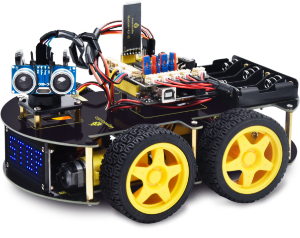

## 1.1 Introduction

Modern society is being driven at an astonishing pace by technological advancements, and STEM education (integrated education in Science, Technology, Engineering, and Mathematics) is receiving increasing attention as a key way to cultivate the next generation of innovative talent.

Arduino, as a tool that bridges programming study, hardware operation, and creative realization, is undoubtedly an ideal platform for STEM education. It not only serves as a programming and hardware learning environment but also inspires student creativity and sparks enthusiasm for learning.

The keyestudio 4WD Car offers up to 15 learning projects, with difficulties progressing step by step. These range from simple sensor applications to building a complex four-wheel-drive smart robot, helping students systematically understand the principles and real-world applications of sensors and hardware modules.

## 1.2 Features

1.  Multi-purpose function: Obstacle avoidance, following, IR remote control, Bluetooth control, ultrasonic following and facial emoticons display.
2.  Easy to build: No soldering circuit required, complete assembly easily.
3.  High Tenacity: Aluminum alloy bracket, metal motors, high quality wheels and tracks.
4.  High extension: expand other sensors and modules through motor driver shield and sensor shield.
5.  Multiple controls: IR remote control, App control(iOS and Android system)
6.  Basic programming：C language code of Arduino IDE.

## 1.3 Specification

- Working voltage: 5v

- Input voltage: 7-12V

- Maximum output current: 2A

- Maximum power dissipation: 25W (T=75℃)

- Motor speed: 5V 200 rpm/min

- Motor drive mode: dual H bridge drive

- Ultrasonic induction angle: \< 15 degrees

- Ultrasonic detection distance: 2cm-400cm

- Infrared remote control distance: 10 meters (measured)

- Bluetooth remote control distance: 50 meters (measured)

- Bluetooth control: support both Android and iOS system

## 1.4 Product List

| No.  | Name                                                   | QTY  | Picture                                                      |
| ---- | ------------------------------------------------------ | ---- | ------------------------------------------------------------ |
| 1    | Keyestudio V4.0 Board                                  | 1    | 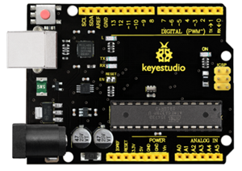                       |
| 2    | Keyestudio Motor Driver Shield                         | 1    | 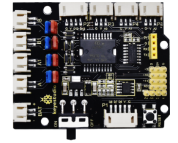                       |
| 3    | Keyestudio HM-10 Bluetooth-4.0                         | 1    | 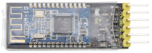                       |
| 4    | Red LED Module                                         | 1    | 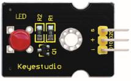                       |
| 5    | HC-SR04 Ultrasonic Sensor                              | 1    | 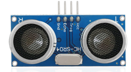                       |
| 6    | Keyestudio Line Tracking Sensor                        | 1    | 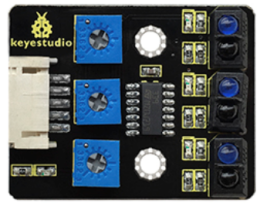 |
| 7    | Keyestudio IR Receiver Sensor                          | 1    | 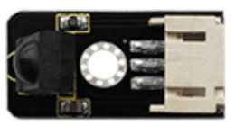                       |
| 8    | Keyestudio 8\*16 LED Dot Matrix, with 4pin Dupont Line | 1    | 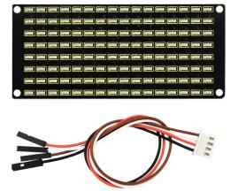                       |
| 9    | Keyestudio 9G Servo                                    | 1    | 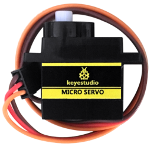                       |
| 10   | Keyestudio Remote Control                              | 1    |                        |
| 11   | USB Cable                                              | 1    | 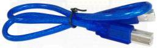                       |
| 12   | 18650 Battery Holder                                   | 1    | 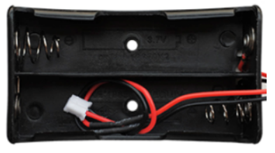                       |
| 13   | 6 AA Battery Holder                                    | 1    | 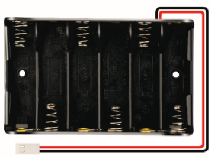                       |
| 14   | Servo Platform                                         | 1    | 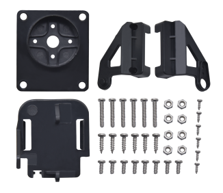                       |
| 15   | 15CM F-F 5P 24AWG Dupont Wire                          | 1    | 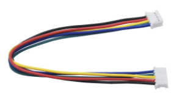                       |
| 16   | 8cm F-F 3P 24AWG Dupont Wire                           | 1    | 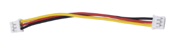                       |
| 17   | 4P to 1P Female DuPont Wire                            | 1    | 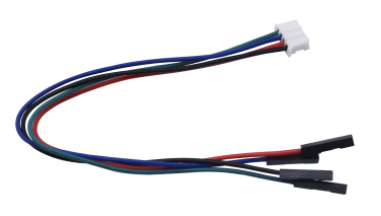                       |
| 18   | Acrylic Board                                          | 1    | 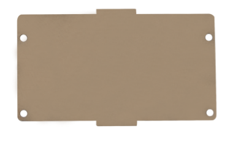                       |
| 19   | Keyestudio 4WD Smart Car V2.0 Top Board                | 1    | 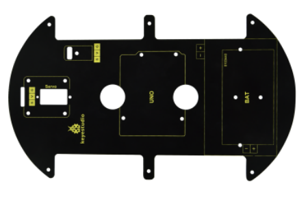                       |
| 20   | Keyestudio 4WD Smart Car V2.0 Bottom PCB               | 1    | 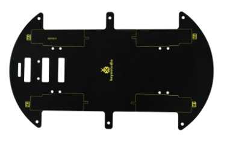                       |
| 21   | Fixed Parts                                            | 4    | 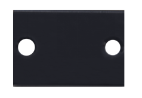                       |
| 22   | Wheel                                                  | 4    | 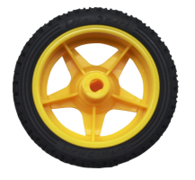                       |
| 23   | M3\*10MM Dual-pass Copper Bush                         | 10   | 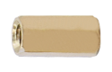                       |
| 24   | M3\*40MM Dual-pass Copper Bush                         | 4    | 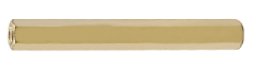                       |
| 25   | M3\*30MM Round Head Screws                             | 8    | 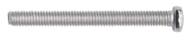                       |
| 26   | M3\*6MM Round Head Screws                              | 40   | 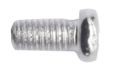                       |
| 27   | M3 Nickel Plated Nuts                                  | 16   | 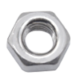                       |
| 28   | M2X8MM Round Head Screws                               | 6    | 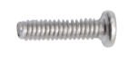                       |
| 29   | M3\*8MM Round Head Screws                              | 4    | 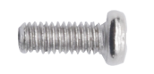                       |
| 30   | M2 Nickel Plated Nuts                                  | 6    | 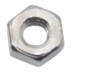                       |
| 31   | M3\*10MM Flat Screws                                   | 3    | 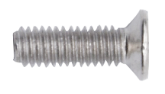                       |
| 32   | Motor (with welding wire)                              | 4    | 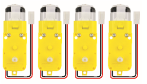                       |
| 33   | 3\*40MM Screwdriver                                    | 1    | 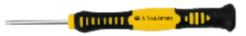                       |
| 34   | Black Nylon Ties 3\*100MM                              | 6    | 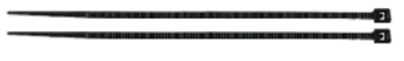                       |
| 35   | Winding Pipe                                           | 1    | 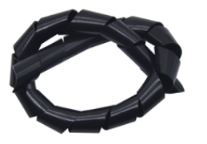                       |
| 36   | 3Pin F-F Dupont Wire (20CM)                            | 3    | 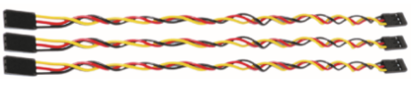                       |
| 37   | Decorative Board                                       | 1    | 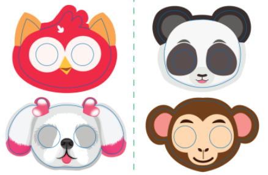                       |

## 1.5 Keyestudio V4.0 Development Board

You need to know that keyestudio V4.0 development board is the core of this smart car.

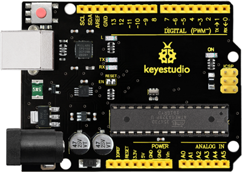

Keyestudio V4.0 development board is an Arduino uno-compatible board, which is based on ATmega328P MCU, and with a cp2102 Chip as a UART-to-USB converter.

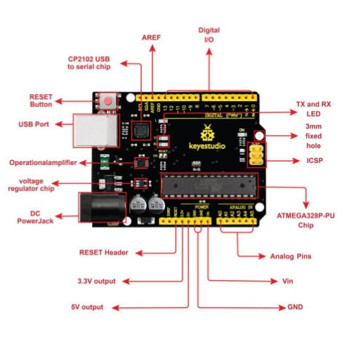

It has 14 digital input/output pins (of which 6 can be used as PWM outputs), 6 analog inputs, a 16 MHz quartz crystal, a USB connection, a power jack, 2 ICSP headers and a reset button.

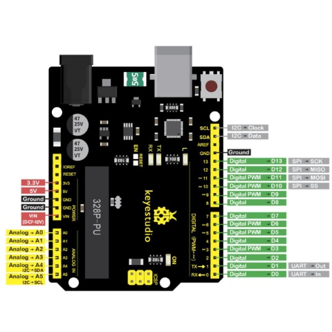

It contains everything needed to support the microcontroller. Simply connect it to a computer with a USB cable or power it via an external DC power jack (DC 7-12V) or via female headers Vin/ GND(DC 7-12V) to get started.

| Microcontroller             | ATmega328P-PU                                            |
| --------------------------- | -------------------------------------------------------- |
| Operating Voltage           | 5V                                                       |
| Input Voltage (recommended) | DC7-12V                                                  |
| Digital I/O Pins            | 14 (D0-D13) (of which 6 provide PWM output)              |
| PWM Digital I/O Pins        | 6 (D3, D5, D6, D9, D10, D11)                             |
| Analog Input Pins           | 6 (A0-A5)                                                |
| DC Current per I/O Pin      | 20 mA                                                    |
| DC Current for 3.3V Pin     | 50 mA                                                    |
| Flash Memory                | 32 KB (ATmega328P-PU) of which 0.5 KB used by bootloader |
| SRAM                        | 2 KB (ATmega328P-PU)                                     |
| EEPROM                      | 1 KB (ATmega328P-PU)                                     |
| Clock Speed                 | 16 MHz                                                   |
| LED_BUILTIN                 | D13                                                      |