# 2. Product installation

**Note: Peel the plastic film off the board first when installing the smart car.**

**Step 1 Mount the Bottom PCB**

Prepare the parts as follows:

1.  Gear Motor x4
2.  Fixed Part x4
3.  M3 Nickel Plated Nut x10
4.  3x6mm Round-head Screw x14
5.  4WD Bottom PCB x1
6.  Tracking Sensor x1
7.  Wheel x4
8.  5P Dupont Wire x1
9.  M3x40mm Copper Pillarx6
10.  M3x30m Round-head Screw x8
11.  M3x8mm Round-head Screw x2

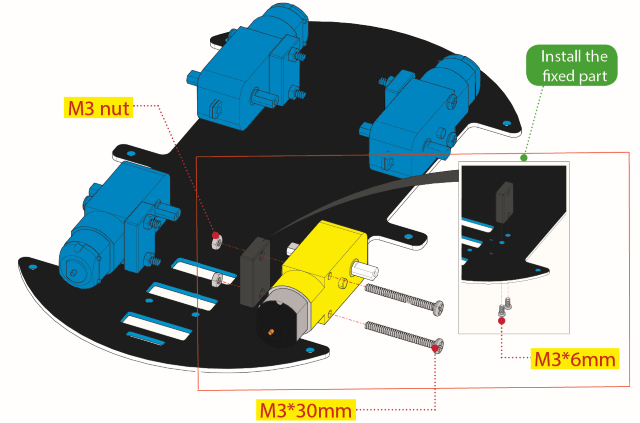

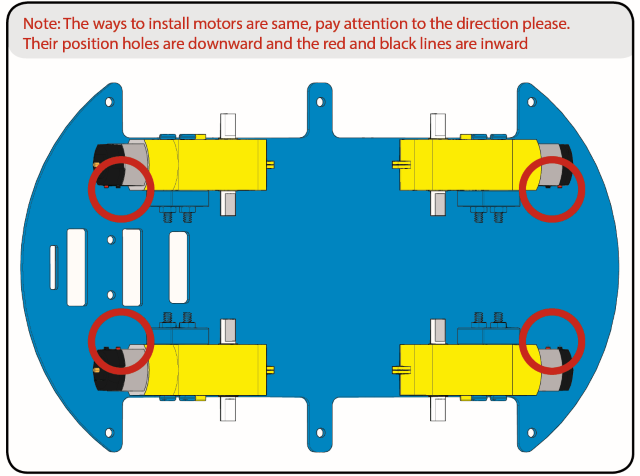

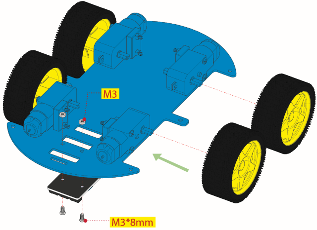

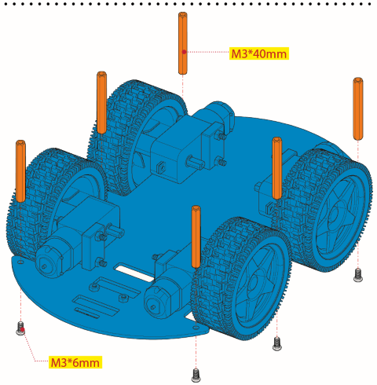

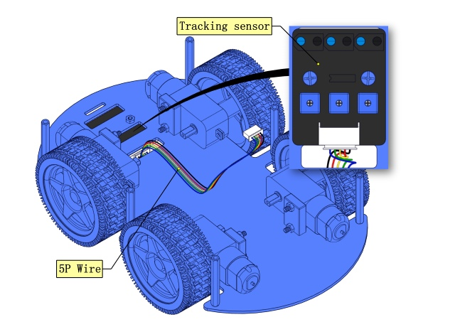


**Step 2 Install Dot Matrix**

Prepare the parts as follows:

1.  8X16 LED Panel x1
2.  4WD Baffle
3.  4P Wire x1
4.  M2x8mm Round-head Screw x4
5.  M2 Nut x4

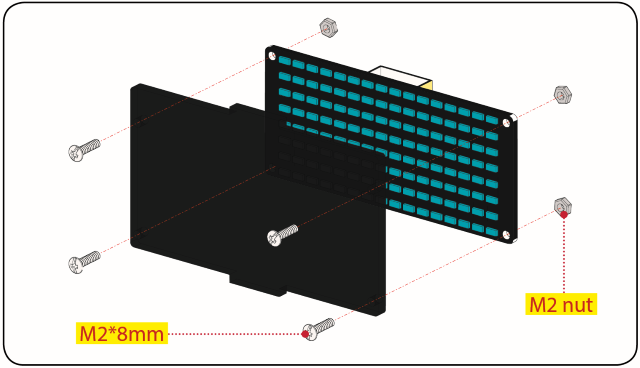

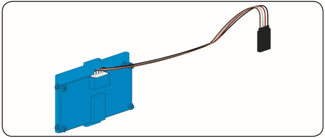

**Step 3  Install the Plastic Platform of Servo**

Prepare the parts as follows:

1.  Servo x1
2.  M2x4 Screw x1
3.  Black Cable Tiex2
4.  Ultrasonic Sensorx1
5.  Black Plastic Platform x1
6.  M1.2x4 Tapping Screw x4
7.  M2x8 Tapping Screw x2

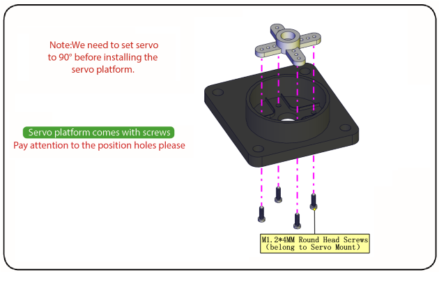

You can find M1.2x4 screws inside the bag of the servo platform.


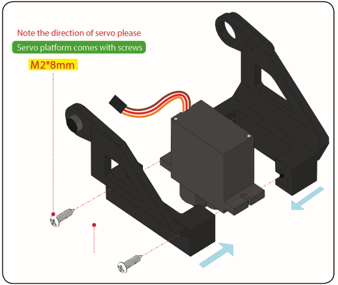

**Code for adjusting the servo**

To keep the servo motor at the correct angle, we need to upload the following code to the development board to adjust the servo's angle.

```c
/*
Set the 90-degree code,Copy the code and upload it to the development board. The steering gear connected to port D9 will rotate to 90 °
*/
#define servoPin 9 //servo Pin
int pos; //the angle variable of servo
int pulsewidth; // pulse width variable of servo

void setup() 
{
    pinMode(servoPin, OUTPUT); //set servo pin to OUTPUT
    procedure(0); //set the angle of servo to 0°
}

void loop() 
{
	procedure(90); // tell servo to go to position in variable 90°
}

// function to control servo
void procedure(int myangle) 
{
    pulsewidth = myangle x 11 + 500; //calculate the value of pulse width
    digitalWrite(servoPin,HIGH);
    delayMicroseconds(pulsewidth); //The duration of high level is pulse width
    digitalWrite(servoPin,LOW);
    delay((20 - pulsewidth / 1000)); // the cycle is 20ms, the low level last for the rest of time
}
```

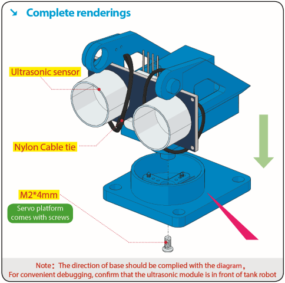

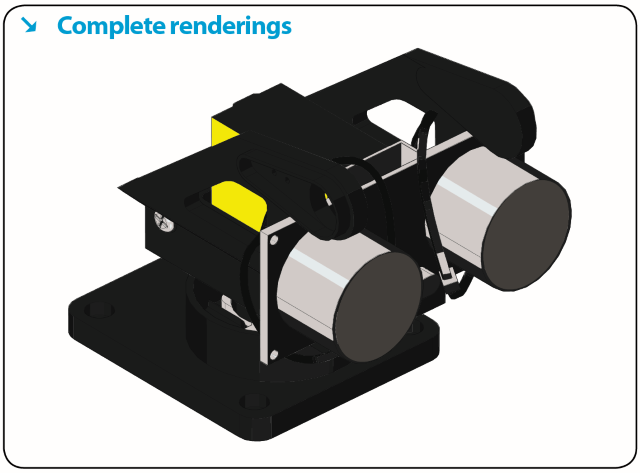

**Step 4 Assemble Battery Holder**

Prepare the parts as follows:

1.  Top PCB x1
2.  M3 Nut x3
3.  Motor Driver Board x1
4.  Control Board x1
5.  IR Receiver Module x1
6.  M3x10mm Copper Pillar x8
7.  M3x8mm Round-head Screw x1
8.  M3x6mm Round-head Screw x16
9.  M3x10mm Flat-head Screw x2
10.  6 AA Battery Holder x1

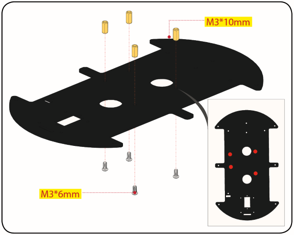

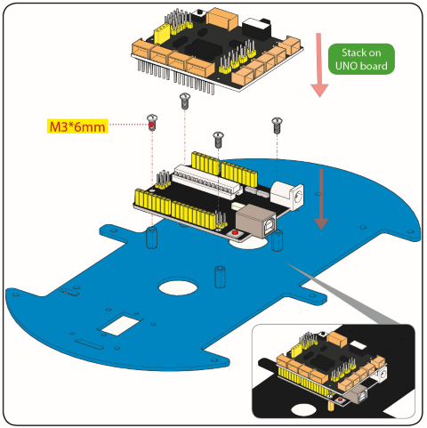

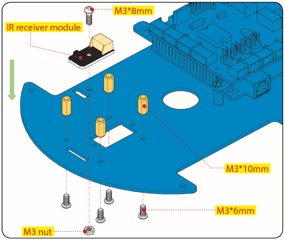

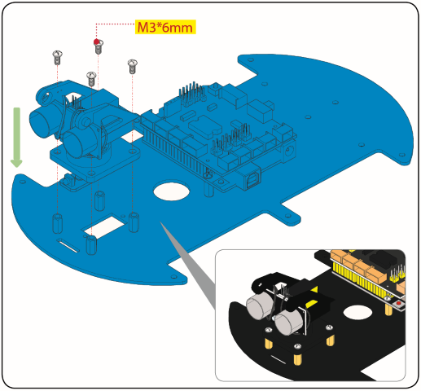

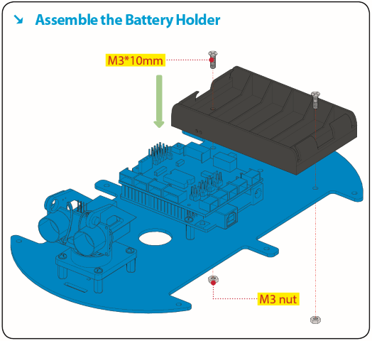

**Step 5 Mount the Top PCB**

Prepare the parts as follows:

1. Bluetooth Module x1

2. M3x6MM Round-head Screw x6

3. Jumper Capx8

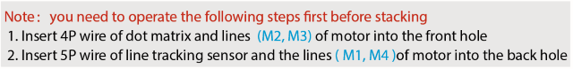

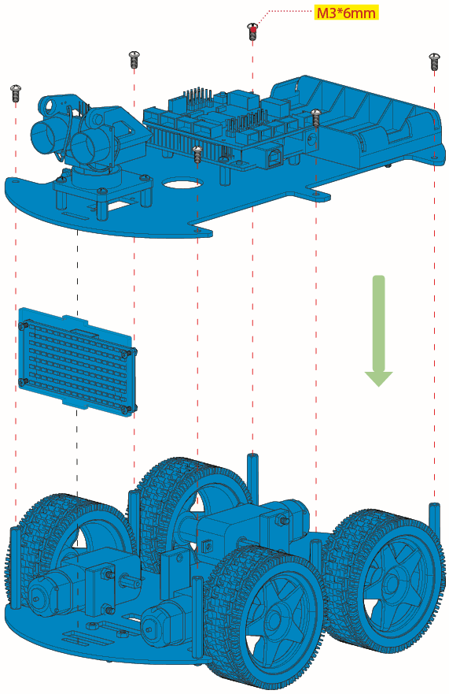

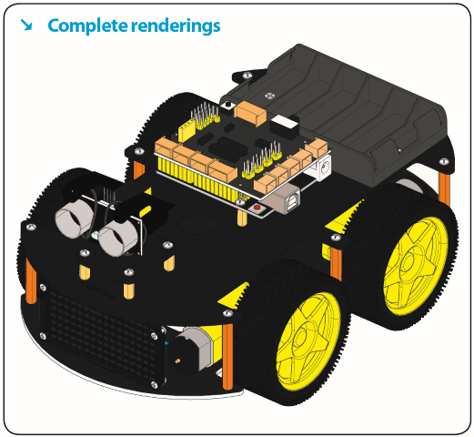

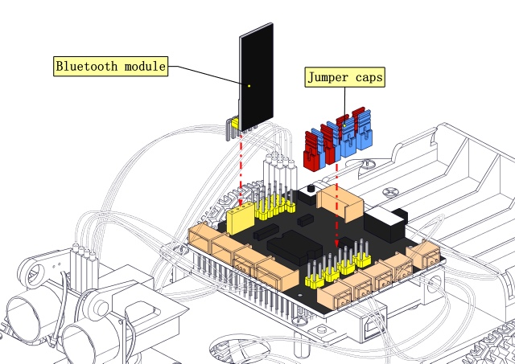

**Step 6 Hook-up Guide**

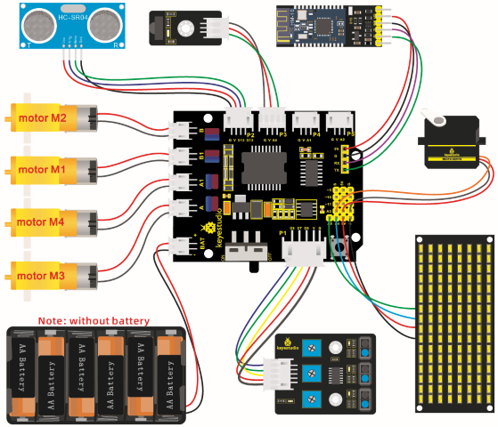

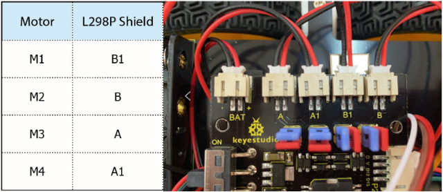

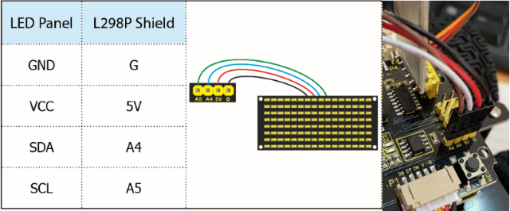

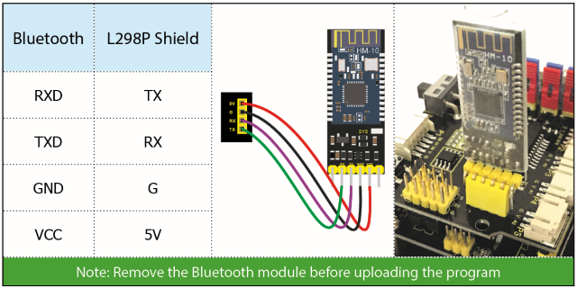

**Important reminder: Please unplug the Bluetooth module before starting the upcoming lessons; otherwise, the program upload will fail.**

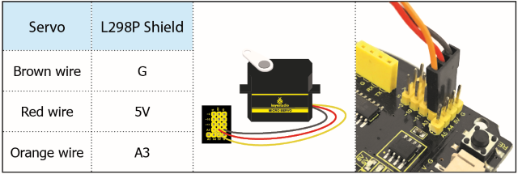

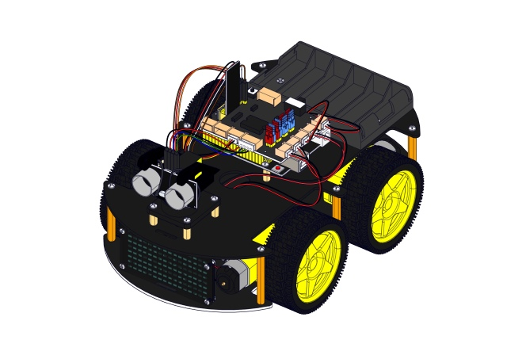