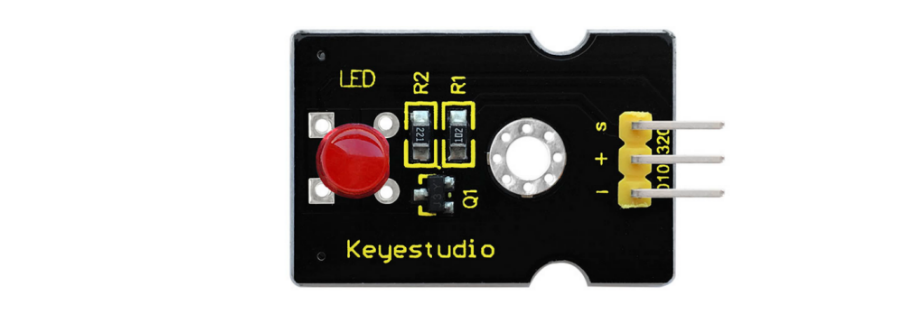
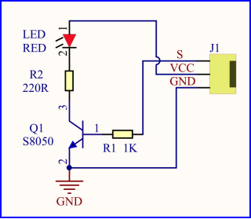
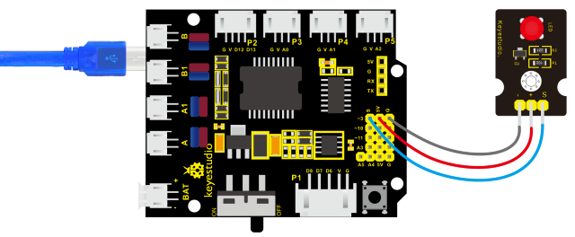

### Project 1 LED Blink



**1. Description**

For starters , LED Blink is a fundamental program. LED, the abbreviation of light emitting diodes, consists of Ga, As, P, N chemical compounds and so on. The LED can flash in diverse colors by altering the delay time in the test code. When in control, power on GND and VCC, the LED will be on if S end is in high level; nevertheless, it will go off.

**2. Specification**



-   Control interface: digital port
-   Working voltage: DC 3.3-5V
-   Pin spacing: 2.54mm
-   LED display color: red

**3. What You Need**


**4. Wiring Diagram**



The expansion board is stacked on development board; LED module is connected to G of shield;“+”is linked with 5V; S end is attached to D3.

**5.Test Code**

```c
/*
keyestudio 4wd BT Car V2
lesson 1.1
Blink
http://www.keyestudio.com
*/
void setup()
{ 
    pinMode(9, OUTPUT);       // initialize digital pin 3 as an output.
}

void loop()               // the loop function runs over and over again forever
{   
	digitalWrite(9, HIGH);    // turn the LED on (HIGH is the voltage level)
    delay(1000);              // wait for a second
    digitalWrite(9, LOW);     // turn the LED off by making the voltage LOW
    delay(1000);              // wait for a second
}
```

**6. Test Result**

Upload the program, LED blinks at the interval of 1s.

**7. Code Explanation**

```
pinMode(3，OUTPUT);//This function can denote that the pin is INPUT or OUTPU
```

```
digitalWrite(3, HIGH);//When pin is OUTPUT, we can set it to HIGH(output 5V) or LOW(output 0V)
```

**8. Extension Practice**

We have succeeded in blinking LED. Next, let’s observe what will happen to the LED if we modify pins and delay time.

```c
/*
keyestudio 4wd BT Car V2
lesson 1.2
delay
http://www.keyestudio.com
*/

void setup() 
{               // initialize digital pin 11 as an output.
    pinMode(9, OUTPUT);
}

// the loop function runs over and over again forever
void loop()
{   
    digitalWrite(9, HIGH); // turn the LED on (HIGH is the voltage level)
    delay(100);              // wait for 0.1 second
    digitalWrite(9, LOW);    // turn the LED off by making the voltage LOW
    delay(100);              // wait for 0.1 second
}
```

The test result shows that the LED flashes faster. Therefore, we can draw a conclusion that pins and time delaying affect flash frequency.
