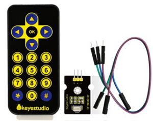
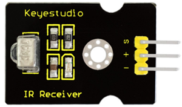
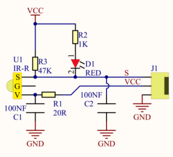
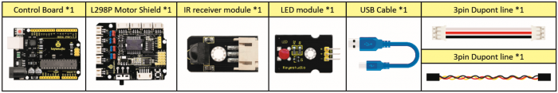
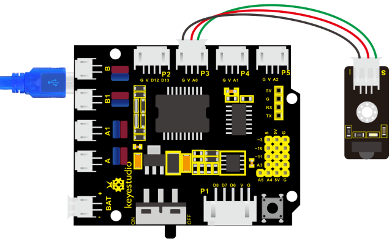
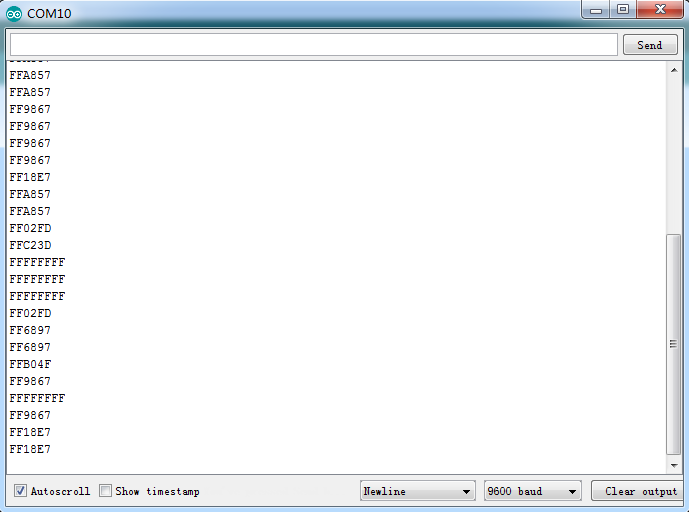
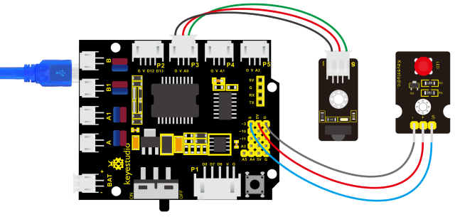

### Project 11 IR remote control

**1. Description**

There is no doubt that infrared remote control is ubiquitous in daily life. It is used to control various household appliances, such as TVs, stereos, video recorders and satellite signal receivers. Infrared remote control is composed of infrared transmitting and infrared receiving systems, that is, an infrared remote control and infrared receiving module and a single-chip microcomputer capable of decoding.​



The 38K infrared carrier signal emitted by remote controller is encoded by the encoding chip in the remote controller. It is composed of a section of pilot code, user code, user inverse code, data code, and data inverse code. The time interval of the pulse is used to distinguish whether it is a 0 or 1 signal and the encoding is made up of these 0, 1 signals.

The user code of the same remote control is unchanged while the data code can distinguish the key.

When the remote control button is pressed, the remote control sends out an infrared carrier signal. When the IR receiver receives the signal, the program will decode the carrier signal and determines which key is pressed. The MCU decodes the received 01 signal, thereby judging what key is pressed by the remote control.

Infrared receiver we use is an infrared receiver module. Mainly composed of an infrared receiver head, which is a device that integrates reception, amplification, and demodulation. Its internal IC has completed demodulation, and can achieve from infrared reception to output and be compatible with TTL signals. Additionally, it is suitable for infrared remote control and infrared data transmission. The infrared receiving module made by the receiver has only three pins, signal line, VCC and GND. It is very convenient to communicate with arduino and other microcontrollers.

**2. Specification**





- Operating Voltage: 3.3-5V（DC）

- Interface: 3PIN

- Output Signal: Digital signal

- Receiving Angle: 90 degrees

- Frequency: 38khz

- Receiving Distance: 10m

**3. What You Need**



**4. Connection Diagram**



Respectively link“-”,“+”and S of IR receiver module with G(GND）, V（VCC）and A0 of keyestudio development board.

Attention: On the condition that digital ports are not available, analog ports can be regarded as digital ports. A0 equals to D14, A1 is equivalent to digital 15.

**5. Test Code**

Firstly import library file of IR receiver module(refer to how to import Arduino library file) before designing code.

```c
/*
    keyestudio 4wd BT Car V2
    lesson 11.1
    IRremote
    http://www.keyestudio.com
*/ 

#include <IRremote.h>           // IRremote library statement
int RECV_PIN = 3;               //define the pins of IR receiver as 3
IRrecv irrecv(RECV_PIN);   
decode_results results;         // decode results exist in the“result” of “decode results”

void setup()  
{  
    Serial.begin(9600);  
    irrecv.enableIRIn();        // Enable receiver
}

void loop() 
{  
    if (irrecv.decode(&results)) //decode successfully, receive a set of infrared signals
    {  
        Serial.println(results.value, HEX);//Wrap word in 16 HEX to output and receive code 
        irrecv.resume();// Receive the next value
    }  
    delay(100);  
} 
```

**6. Test Result**

Upload test code, open serial monitor and set baud rate to 9600, point remote control to IR receiver and the corresponding value will be shown. If pressing too long, the error codes will appear.



Below we have listed out each button value of keyestudio remote control. So you can keep it for reference.


**7. Code Explanation**

**irrecv.enableIRIn():** after enabling IR decoding, the IR signals will be received, then function“decode()”will check continuously if decode successfully.

**irrecv.decode(&results):** after decoding successfully, this function will come back to “true”, and keep result in “results”. After decoding a IR signals, run the resume()function and receive the next signal.

**8. Extension Practice**

We decoded the key value of IR remote control. How about controlling LED by the measured value? We could design an experiment.

Attach an LED to D3, then press the keys of remote control to make LED light on and off.



```c
/* keyestudio 4wd BT Car V2
lesson 11.2
IRremote
http://www.keyestudio.com
*/ 
#include <IRremote.h>
int RECV_PIN = 3;               //define the pin of IR receiver as 3
int LED_PIN=9;                  // define the pin of LED as pin 9
int a=0;
IRrecv irrecv(RECV_PIN);
decode_results results;

void setup()
{
	Serial.begin(9600);
    irrecv.enableIRIn();       //  Initialize the IR receiver 
    pinMode(LED_PIN,OUTPUT);   //set pin 3 of LED to OUTPUT
}

void loop() 
{
    if (irrecv.decode(&results)) 
    {
        if(results.value==0xFF02FD &a==0) //according to the above key value, press“OK”on remote control , LED will be controlled
        {
            digitalWrite(LED_PIN,HIGH);      //LED will be on
            a=1;
        }
        else if(results.value==0xFF02FD &a==1) //press again
        {
            digitalWrite(LED_PIN,LOW);             //LED will go off
            a=0;
        }
        irrecv.resume();                   // receive the next value
    }
}
```

Upload code to development board, press“OK”key on remote control to make LED on and off.