### Project 13 Bluetooth

**1. Description**

Bluetooth, a simple wireless communication module, has went viral since the last few decades and been used in most of the battery-powered devices for its easy-to-use function.

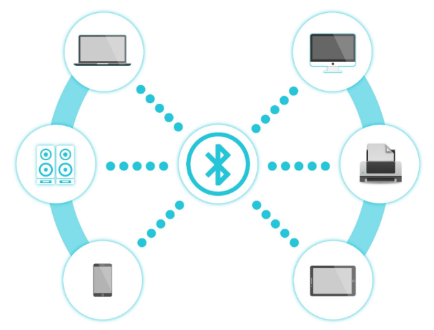

Over the past years, there have been many upgrades of Bluetooth standard to fulfil the demands of customers and the development of technology as well as to follow the trend of time.

Over the few years, there are many things changed including data transmission rate, power consumption with wearable and IoT Devices and Security System.

Here are we going to learn about HM-10 BLE 4.0 with Arduino Board? The HM-10 is a readily available Bluetooth 4.0 module. This module is used for establishing wireless data communication. The module is designed by using the Texas Instruments CC2540 or CC2541 Bluetooth low energy (BLE) System on Chip (SoC).

**2. Specification**

- Bluetooth protocol: Bluetooth Specification V4.0 BLE

- No byte limit in serial port Transceiving

- In open environment, realize 100m ultra-distance communication with iphone4s

- Working frequency: 2.4GHz ISM band

- Modulation method: GFSK(Gaussian Frequency Shift Keying)

- Transmission power: -23dbm, -6dbm, 0dbm, 6dbm, can be modified by AT command.

- Sensitivity: ≤-84dBm at 0.1% BER

- Transmission rate: Asynchronous: 6K bytes ; Synchronous: 6k Bytes

- Security feature: Authentication and encryption

- Supporting service: Central & Peripheral UUID FFE0, FFE1

- Power consumption: Auto sleep mode, stand by current 400uA\~800uA, 8.5mA during transmission.

- Power supply: 5V DC

- Working temperature: –5 to +65 Centigrade

**3. What You Need**

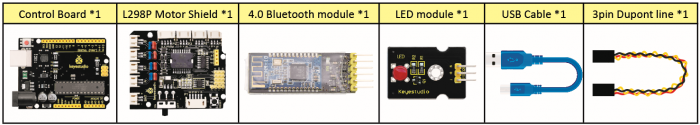

**4. Connection Diagram**

- **STATE:** state test pins, connected to internal LED, generally keep it unconnected.
- **RXD:** serial interface, receiving terminal.
- **TXD:** serial interface, transmitting terminal.
- **GND:** Ground.
- **VCC:** positive pole of the power source.
- **EN/BRK:** break connect, it means breaking the Bluetooth connection, generally, keep it unconnected.

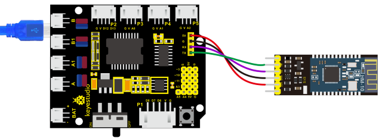

**Pay attention to the pin direction when inserting Bluetooth module, and don’t insert it before uploading test code.**

**5. Test Code**

```c
/*
keyestudio 4wd BT Car V2.0
lesson 13.1
bluetooth 
http://www.keyestudio.com
*/

char ble_val; //character variable, used to save the value received by Bluetooth 

void setup() 
{
    Serial.begin(9600);
}

void loop() 
{
    if(Serial.available() > 0)  //make sure if there is data in serial buffer
    {
        ble_val = Serial.read();  //Read data from serial buffer
        Serial.println(ble_val);  //Print
    }
}
```

**(There will be contradiction between serial communication of code and communication of Bluetooth when uploading code. Therefore, don’t link Bluetooth module before uploading code.)**

**After uploading code on development board, then insert Bluetooth module and wait for the command from your cellphone.**

**6. Download APP**

The code is for reading the received signal, and we also need a device to send signals. In this project, we send signals to control robot car via a cellphone. Therefore, we need to download the APP.

- **For iOS system**

**Note: Allow APP to access“location”in settings of your cellphone when connecting to Bluetooth module; otherwise, Bluetooth may not be connected.**

Enter APP STORE to search **BLE Scanner 4.0, then download it.**

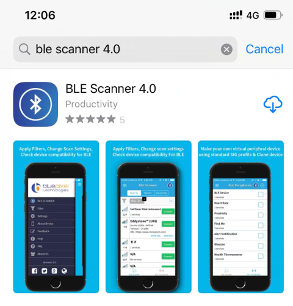

- **For Android system**

Enter [Google Play](https://developer.android.google.cn/distribute?hl=zh-cn) to find out **BLE Scanner, then download.**

**And allow APP to access“location”, you could enable“location”in settings of your cellphone.**

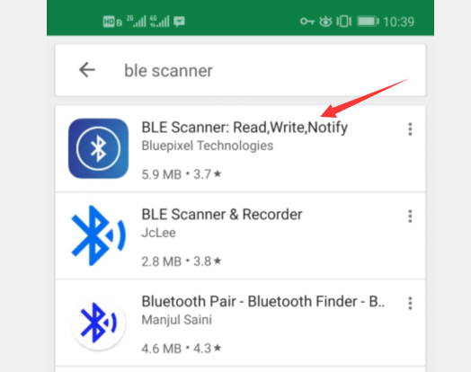

1. After installation, open App and enable“Location and Bluetooth” permission.

2. Open App, the name of Bluetooth module is HMSoft.

Then click “connect” to link it with Bluetooth

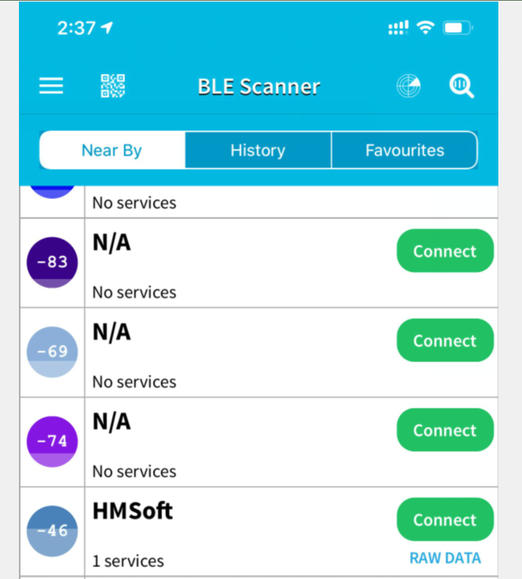

After connecting to HMSoft, click it to get multiple options, such as device information, access permission, general and custom service. Choose “CUSTOM SERVICE”

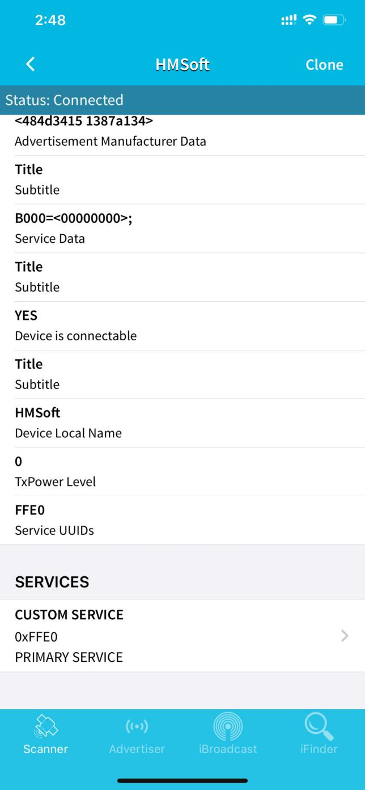

Then the following page pops up.

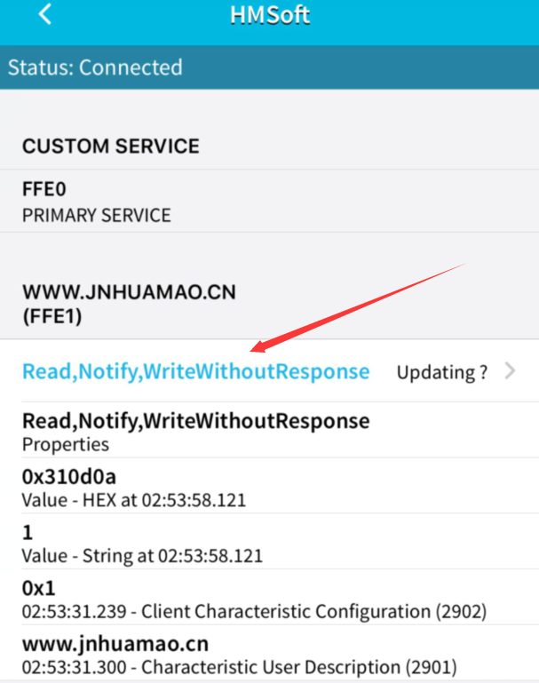

Click（Read,Notify,WriteWithoutResponse)to enter the following page

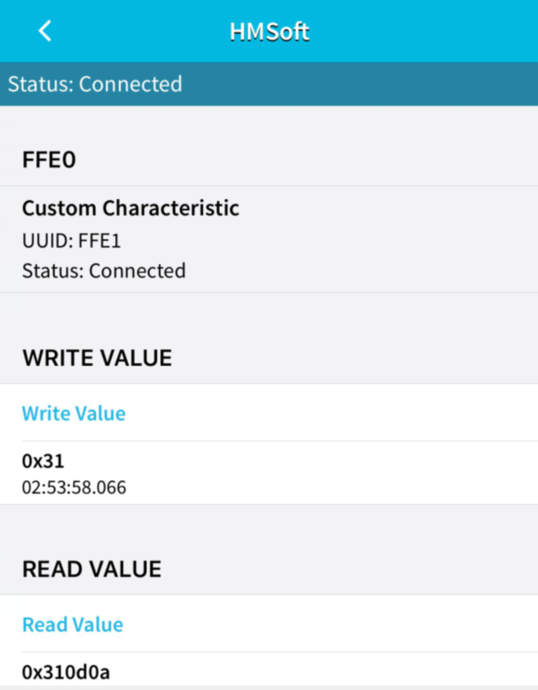

Click **Write Value to enter HEX or Text.**

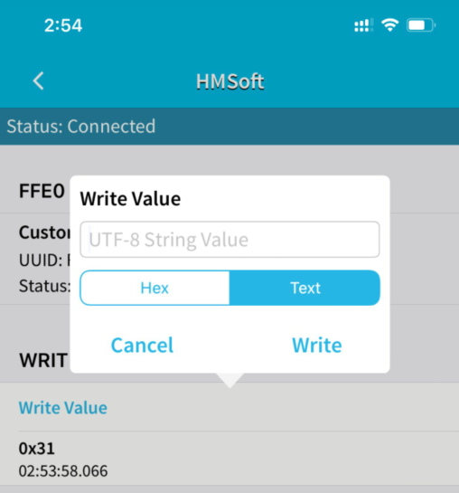

Open the serial monitor on Arduino，enter a 0 or other characters on Text interface.


Then click“Write”, open serial monitor to view if there is a“0”signal.


**9. Code Explanation**

**Serial.available()** : The current rest characters when return to buffer area. Generally, this function is used to judge if there is data in buffer. When Serial.available()\>0, it means that receives the data and can be read.

xxSerial.read()：xxRead a data of a Byte in buffer of serial port, for instance, device sends data to Arduino via serial port, then we could read data by “Serial.read()”.

**10. Extension Practice**

We could send a command via Bluetooth to turn a LED on and off.

D3 is connected to a LED, as shown below:

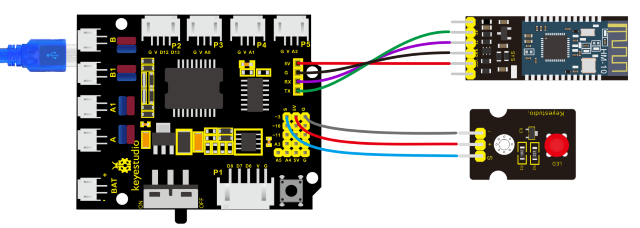

```c
/*
keyestudio 4wd BT Car V2.0
lesson 13.2
Bluetooth 
http://www.keyestudio.com
*/

int ledpin=9;
void setup()
{
    Serial.begin(9600);
    pinMode(ledpin,OUTPUT);
}

void loop()
{
    int i;
    if (Serial.available())
    {
        i=Serial.read();
        Serial.println("DATA RECEIVED:");
        if(i=='1')
        {
            digitalWrite(ledpin,1);
            Serial.println("led on");
        }
        if(i=='0')
        {
            digitalWrite(ledpin,0);
            Serial.println("led off");
        }
    }
}
```

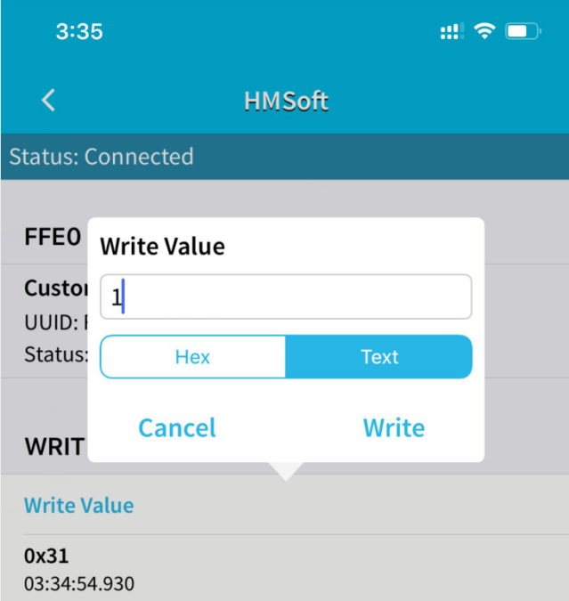

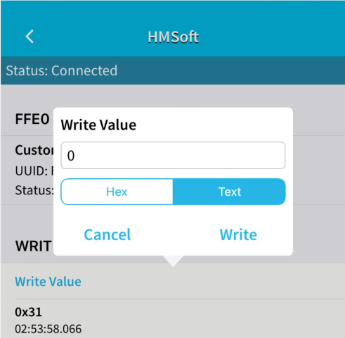

Click“Write”on APP, when you enter 1, LED will be on;when you input 0, it will be off. **(Remember to remove the Bluetooth module after finishing experiment. Otherwise, burning code will be affected)**

