### Project 14 Bluetooth Control Robot

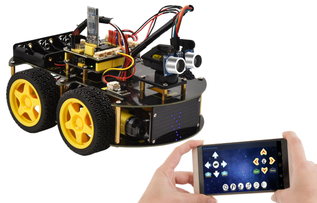

**1. Description**

We’ve learned the basic knowledge of Bluetooth. And in this lesson, we will make a Bluetooth remote smart car. In this experiment, we default the HM-10 Bluetooth module as a Slave and the cellphone as a Host.

keyes BT car is an APP rolled out by keyestudio team. You can control the robot car by it readily.

**2. Test APP**

**Special note: before uploading the test code, you need to remove the Bluetooth module. Otherwise, the test code will fail to upload. You can reconnect the Bluetooth module when the code is uploaded successfully.**

```c
/*
keyestudio 4WD BT Car V2.0
lesson 14.1
Bluetooth test
<http://www.keyestudio.com>
*/

char BLE_val;
void setup()
{
    Serial.begin(9600);
}

void loop()
{
    if(Serial.available()>0)
    {
        BLE_val = Serial.read();
        Serial.println(BLE_val);
    }
}
```

Upload test code on V4.0 development board and insert the Bluetooth module. Then we need to download the APP.

**3. Download the app and connect Bluetooth**

- **iOS System**

(**There are two ways to download the app, please choose according to your needs.**)

1. **You can download the Apple system app here**.

   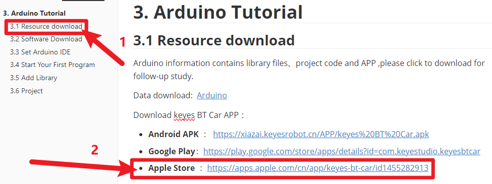

2. Open the App Store, search for and download Keyes BT Car.

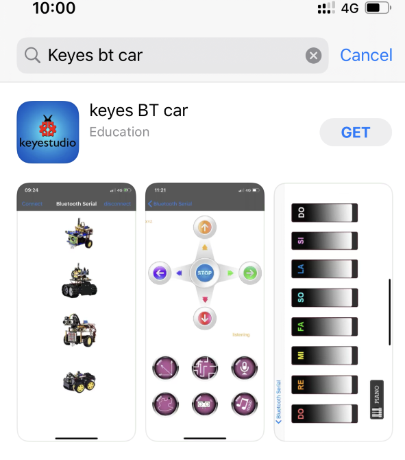

After installation is complete, an application icon will appear on the desktop.

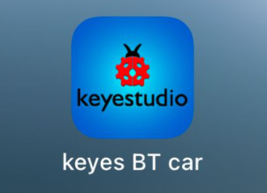

Turn on your phone's Bluetooth and location services, and allow Keyes BT Car to access Bluetooth.

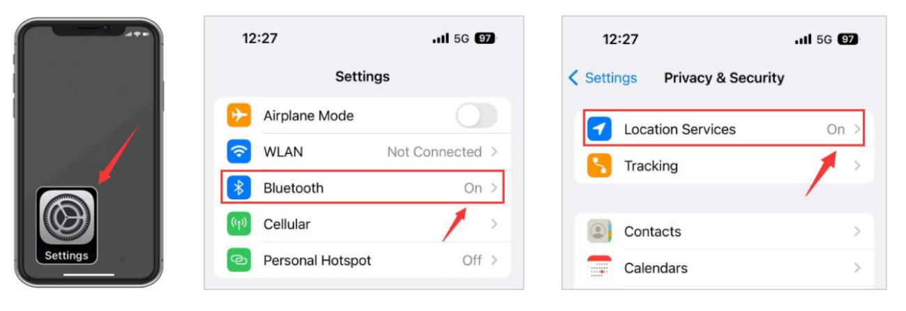

Open the Keyes BT car app, tap the Bluetooth button in the top right corner to scan for devices, find the Bluetooth name, and connect.


After the Bluetooth connection is complete, select "4WD Robot".

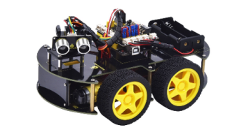

If the LED on the Bluetooth module stops flashing and stays lit, it means the connection is successful. The image below shows the interface of the app.

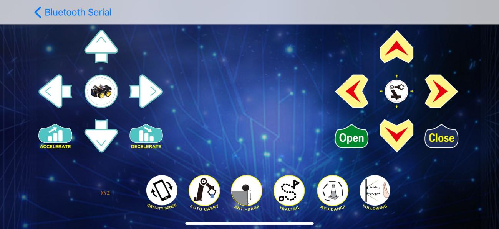

- **Android System**

(**There are two ways to download the app, please choose according to your needs.**)

1.**You can download the Android system app here**.

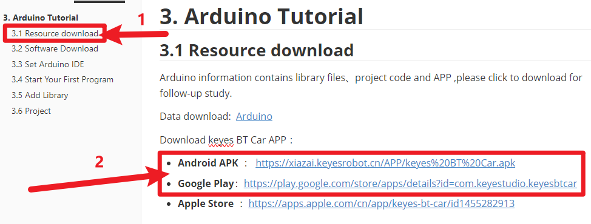

2. Search for "Keyes 4wd car" on Google Play or download it via the provided link.

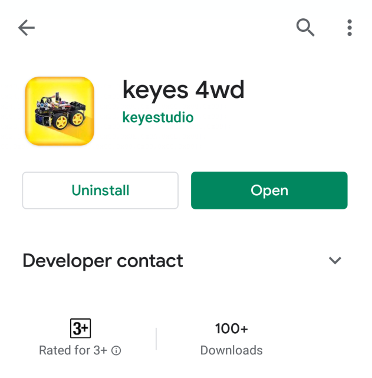

Turn on your phone's Bluetooth and location services, and enable location and nearby device permissions for the app in the settings.

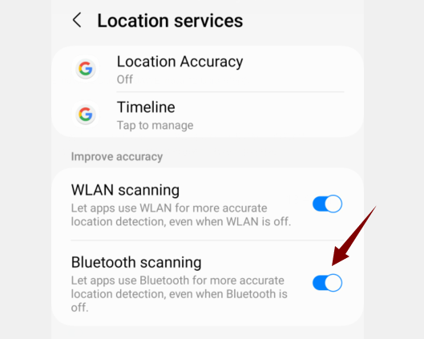

Open the Keyes BT Car app and tap the connect button in the top right corner.

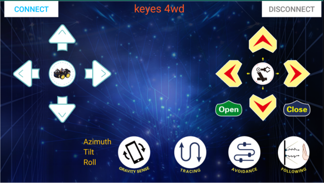

Find the Bluetooth name and connect.

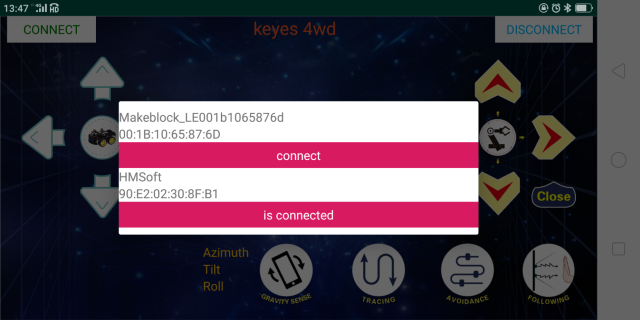

The LED on the Bluetooth module stops flashing and stays solid, indicating a successful connection.

**4. Flow Chart**

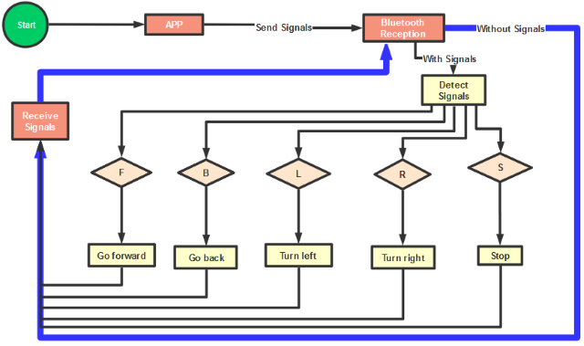

**5. Hook-up Diagram**

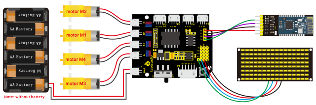

**5. Test Code**

```c
/*
keyestudio 4wd BT Car V2.0
lesson 14.2
Bluetooth Remote Control
http://www.keyestudio.com
*/ 
//Array, used to store the data of pattern, can be calculated by yourself or obtained from the modulus tool
unsigned char start01[] = {0x01,0x02,0x04,0x08,0x10,0x20,0x40,0x80,0x80,0x40,0x20,0x10,0x08,0x04,0x02,0x01};
unsigned char front[] = {0x00,0x00,0x00,0x00,0x00,0x24,0x12,0x09,0x12,0x24,0x00,0x00,0x00,0x00,0x00,0x00};
unsigned char back[] = {0x00,0x00,0x00,0x00,0x00,0x24,0x12,0x09,0x12,0x24,0x00,0x00,0x00,0x00,0x00,0x00};
unsigned char left[] = {0x00,0x00,0x00,0x00,0x00,0x00,0x44,0x28,0x10,0x44,0x28,0x10,0x44,0x28,0x10,0x00};
unsigned char right[] = {0x00,0x10,0x28,0x44,0x10,0x28,0x44,0x10,0x28,0x44,0x00,0x00,0x00,0x00,0x00,0x00};
unsigned char STOP01[] = {0x2E,0x2A,0x3A,0x00,0x02,0x3E,0x02,0x00,0x3E,0x22,0x3E,0x00,0x3E,0x0A,0x0E,0x00};
unsigned char clear[] = {0x00,0x00,0x00,0x00,0x00,0x00,0x00,0x00,0x00,0x00,0x00,0x00,0x00,0x00,0x00,0x00};
#define SCL_Pin  A5  //Set clock pin to A5
#define SDA_Pin  A4  //Set data pin to A4
unsigned char data_line = 0;
unsigned char delay_count = 0;
#define ML_Ctrl 4     //define direction control pin of B motor
#define ML_PWM 5   //define PWM control pin of B motor
#define MR_Ctrl 2    //define direction control pin of A motor
#define MR_PWM 6   //define PWM control pin of A motor
char BLE_val;
void setup() 
{
    Serial.begin(9600);
    pinMode(ML_Ctrl, OUTPUT);//set direction control pin of B motor to OUTPUT
    pinMode(ML_PWM, OUTPUT);//set PWM control pin of B motor to OUTPUT
    pinMode(MR_Ctrl, OUTPUT);//set direction control pin of A motor to OUTPUT
    pinMode(MR_PWM, OUTPUT);//Set PWM control pin of A motor to OUTPUT
//Set pin to output
    pinMode(SCL_Pin,OUTPUT);
    pinMode(SDA_Pin,OUTPUT);
    //Clear the matrix display
    matrix_display(clear);
    matrix_display(start01);
}

void loop() 
{
    if(Serial.available()>0)
    {
        BLE_val = Serial.read();
        Serial.println(BLE_val);
    }
    switch(BLE_val)
    {
        case 'F': car_front(); matrix_display(front); break;
        case 'B': car_back(); matrix_display(back); break;
        case 'L': car_left(); matrix_display(left); break;
        case 'R': car_right(); matrix_display(right); break;
        case 'S': car_Stop();matrix_display(STOP01); break;
    }
}

void car_front()
{
    digitalWrite(ML_Ctrl,HIGH);//set direction control pin of B motor to HIGH 
    analogWrite(ML_PWM,200);//set PWM control speed of B motor to 200
    digitalWrite(MR_Ctrl,HIGH);//set direction control pin of A motor to HIGH
    analogWrite(MR_PWM,200);//set PWM control speed of A motor to 200
}

void car_back()
{
    digitalWrite(ML_Ctrl,LOW);//set direction control pin of B motor to LOW
    analogWrite(ML_PWM,200);//set PWM control speed of B motor to 200
    digitalWrite(MR_Ctrl,LOW);//set direction control pin of A motor to LOW
    analogWrite(MR_PWM,200);//set PWM control speed of A motor to 200
}

void car_left()
{
    digitalWrite(ML_Ctrl,LOW);//set direction control pin of B motor to LOW
    analogWrite(ML_PWM,200);//set PWM control speed of B motor to 200
    digitalWrite(MR_Ctrl,HIGH);//set direction control pin of A motor to HIGH 
    analogWrite(MR_PWM,200);//set PWM control speed of A motor to 200
}

void car_right()
{
    digitalWrite(ML_Ctrl,HIGH);//set direction control pin of B motor to HIGH 
    analogWrite(ML_PWM,200);//set PWM control speed of B motor to 200
    digitalWrite(MR_Ctrl,LOW);//set direction control pin of A motor to LOW
    analogWrite(MR_PWM,200);//set PWM control speed of A motor to 200
}

void car_Stop()
{
    analogWrite(ML_PWM,0);//set PWM control speed of B motor to 0
    analogWrite(MR_PWM,0);//set PWM control speed of A motor to 0
}

//this function is used for dot matrix display
void matrix_display(unsigned char matrix_value[])
{
    IIC_start();  //the function that calls the data transmission
    IIC_send(0xc0);  //Select address
    for(int i = 0;i < 16;i++) //Pattern data has 16 bytes
    {
        IIC_send(matrix_value[i]); //data to convey patterns
    }
    IIC_end();   //end the transmission of patterns data
    IIC_start();
    IIC_send(0x8A);  //display control, set pulse width to 4/16  IIC_end();
    IIC_end();
}

// the condition of data transmission starts 
void IIC_start()
{
    digitalWrite(SCL_Pin,HIGH);
    delayMicroseconds(3);
    digitalWrite(SDA_Pin,HIGH);
    delayMicroseconds(3);
    digitalWrite(SDA_Pin,LOW);
    delayMicroseconds(3);
}

// transmit data
void IIC_send(unsigned char send_data)
{
    for(char i = 0;i < 8;i++)  //Every character has 8 bits
    {
        digitalWrite(SCL_Pin,LOW);  //pull down the SCL_Pin to change the signal of SDA
        delayMicroseconds(3);
        if(send_data & 0x01)  //1 or 0 of byte is used to set high and low level of SDA_Pin
        {
        	digitalWrite(SDA_Pin,HIGH);
        }
        else
        {
        	digitalWrite(SDA_Pin,LOW);
        }
        delayMicroseconds(3);
        digitalWrite(SCL_Pin,HIGH); //Pull up SCL_Pin to stop data transmission
        delayMicroseconds(3);
        send_data = send_data >> 1;  //Detect bit by bit, so move the data right by one bit
    }
}

//the sign that data transmission ends
void IIC_end()
{
    digitalWrite(SCL_Pin,LOW);
    delayMicroseconds(3);
    digitalWrite(SDA_Pin,LOW);
    delayMicroseconds(3);
    digitalWrite(SCL_Pin,HIGH);
    delayMicroseconds(3);
    digitalWrite(SDA_Pin,HIGH);
    delayMicroseconds(3);
} 
```

**6. Test Result**

Upload the code on the V4.0 board. **After uploading code on development board, then insert Bluetooth module and wait for the command from your cellphone.**

After power-on, the DIP switch will be dialed to the“ON”end. And after connecting Bluetooth successfully, we can use the APP to control the smart car to move.