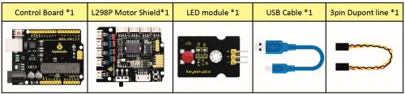
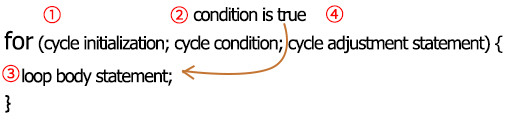
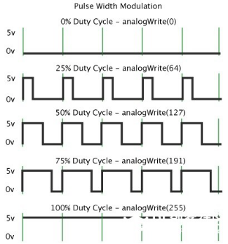

### Project 2 LED PWM

**1. Description**

In previous lesson, we control LED on and off and make it blink.

In this project, we will control LED’s brightness through PWM simulating breathing effect. Similarly, you can change the step length and delay time in the code so as to demonstrate different breathing effects.

PWM is a means of controlling the analog output via digital means. Digital control is used to generate square waves with different duty cycles (a signal that constantly switches between high and low levels) to control the analog output.In general, the input voltages of ports are 0V and 5V. What if the 3V is required? Or a switch among 1V, 3V and 3.5V? We cannot change resistors constantly. For this reason, we resort to PWM.


For Arduino digital port voltage outputs, there are only LOW and HIGH levels, which correspond to the voltage outputs of 0V and 5V respectively. You can define LOW as’ 0 ‘and HIGH as’ 1’, and let the Arduino output five hundred ‘0’ or ‘1’ within 1 second. If output five hundred ‘1’, that is 5V; if all of which is ‘0’,that is 0V; if output 250 01 pattern, that is 2.5V.

This process can be likened to showing a movie. The movie we watch are not completely continuous. Actually, it generates 25 pictures per second, which cannot be told by human eyes. Therefore, we mistake it as a continuous process. PWM works in the same way. To output different voltages, we need to control the ratio of 0 and 1. The more ‘0’or ‘1’ output per unit time, the more accurate the control.

**2. What You Need**



**3. Hook-up Diagram**


**4. Test Code**

```c
/*
keyestudio 4wd BT Car V2
lesson 2.1
pwm
http://www.keyestudio.com
*/
int ledPin = 9;                     // Define the LED pin at D9
int value;

void setup () 
{
    pinMode (ledPin, OUTPUT);       // initialize ledpin as an output.
}

void loop () 
{
    for (value = 0; value <255; value = value + 1) 
    {
        analogWrite (ledPin, value);    // LED lights gradually light up
        delay (5);                      // delay 5MS
    }
    for (value = 255; value> 0; value = value-1) 
    {
        analogWrite (ledPin, value);    // LED gradually goes out
        delay (5);                      // delay 5MS
    }
}
```

**5. Test Result**

Upload test code successfully, LED gradually changes from bright to dark, like human’s breath, rather than turning on and off immediately.

**6. Code Explanation**

To repeat some certain statements, we could use FOR statement.  
FOR statement format is shown below:



FOR cyclic sequence:

Round 1：1 → 2 → 3 → 4

Round 2：2 → 3 → 4

Until number 2 is not established, “for”loop is over.

After knowing this order, go back to code:

for(int value = 0; value \< 255; value=value+1){\*\*

\*\*...}

for (int value = 255; value \>0; value=value-1){\*\*

\*\*...}

The two“for”statements make value increase from 0 to 255, then reduce from 255 to 0, then increase to 255,....infinitely loop

There is a new function in the following ----- analogWrite()

We know that digital port only has two state of 0 and 1. So how to send an analog value to a digital value? Here,this function is needed. Let’s observe the Arduino board and find 6 pins marked“\~”which can output PWM signals.

Function format as follows:

analogWrite(pin,value)

analogWrite() is used to write an analog value from 0\~255 for PWM port, so the value is in the range of 0\~255. Attention that you only write the digital pins with PWM function, such as pin 3, 5, 6, 9, 10, 11.

PWM is a technology to obtain analog quantity through digital method. Digital control forms a square wave, and the square wave signal only has two states of turning on and off (that is, high or low levels). By controlling the ratio of the duration of turning on and off, a voltage varying from 0 to 5V can be simulated. The time turning on(academically referred to as high level) is called pulse width, so PWM is also called pulse width modulation.

Through the following five square waves, let’s acknowledge more about PWM.



In the above figure, the green line represents a period, and value of analogWrite() corresponds to a percentage which is called Duty Cycle as well. Duty cycle implies that high-level duration is divided by low-level duration in a cycle. From top to bottom, the duty cycle of first square wave is 0% and its corresponding value is 0. The LED brightness is lowest, that is, light off. The more time the high level lasts, the brighter the LED. Therefore, the last duty cycle is 100%, which correspond to 255, and LED is the brightest. And 25% means darker.

PWM mostly is used for adjusting the LED’s brightness or the rotation speed of motors.

It plays a vital role in controlling smart robot cars. I believe that you cannot wait to learn next project.

**7. Extension Practice**

Let’s modify the value of delay and remain the pin unchanged, then observe how LED changes.

```c
/*
keyestudio 4wd BT Car V2
lesson 2.2
pwm
http://www.keyestudio.com
*/

int ledPin = 9;    // Define the LED pin at D9

void setup()
{
    pinMode (ledPin, OUTPUT);       // initialize ledpin as an output.
}

void loop()
{
    for (int value = 0; value <255; value = value + 1)
    {
        analogWrite (ledPin, value);    // LED lights gradually light up
        delay (30);                     // delay 30MS
    }
    for(int value=255; value>0;value=value-1)
    {
        analogWrite (ledPin, value);    // LED gradually goes out
        delay (30);                     // delay 30MS
    }
}
```

Upload the code to development board, LED flashes more slowly.