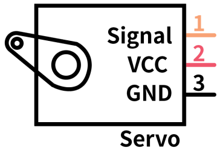
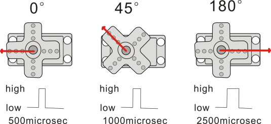
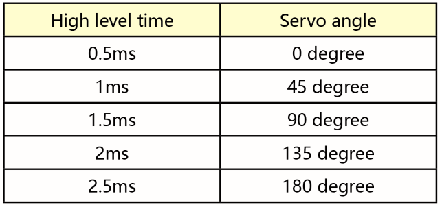
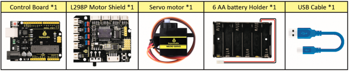
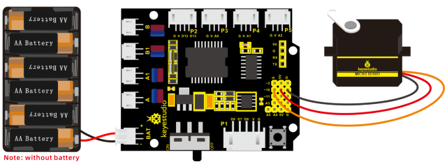
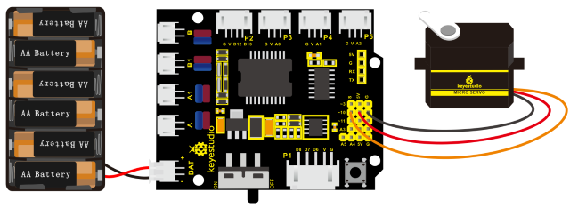

### Project 3 Servo Control


**1. Description**

Servo motor is a position control rotary actuator. It mainly consists of a housing, a circuit board, a core-less motor, a gear and a position sensor. Its working principle is that the servo receives the signal sent by MCU or receiver and produces a reference signal with a period of 20ms and width of 1.5ms, then compares the acquired DC bias voltage to the voltage of the potentiometer and obtain the voltage difference output.

When the motor speed is constant, the potentiometer is driven to rotate through the cascade reduction gear, which leads that the voltage difference is 0, and the motor stops rotating. Generally, the angle range of servo rotation is 0°--180 °

The rotation angle of servo motor is controlled by regulating the duty cycle of PWM (Pulse-Width Modulation) signal. The standard cycle of PWM signal is 20ms (50Hz). Theoretically, the width is distributed between 1ms-2ms, but in fact, it's between 0.5ms-2.5ms. The width corresponds the rotation angle from 0° to 180°. But note that for different brand motors, the same signal may have different rotation angles.



In general, servo has three lines in brown, red and orange. The brown wire is grounded, the red one is a positive pole line and the orange one is a signal line.



The corresponding servo angles are shown below:



**2. Specification**

- Working voltage: DC 4.8V \~ 6V

- Operating angle range: about 180 ° (at 500 → 2500 μsec)

- Pulse width range: 500 → 2500 μsec

- No-load speed: 0.12 ± 0.01 sec / 60 (DC 4.8V) 0.1 ± 0.01 sec / 60 (DC 6V)

- No-load current: 200 ± 20mA (DC 4.8V) 220 ± 20mA (DC 6V)

- Stopping torque: 1.3 ± 0.01kg · cm (DC 4.8V) 1.5 ± 0.1kg · cm (DC 6V)

- Stop current: ≦ 850mA (DC 4.8V) ≦ 1000mA (DC 6V)

- Standby current: 3 ± 1mA (DC 4.8V) 4 ± 1mA (DC 6V)

**3. What You Need**



**4. Connection Diagram**



Wiring note: the brown line of servo is linked with Gnd(G), the red line is connected to 5v(V) and orange line is attached to digit 10.

The servo has to be connected to external power due to its high demand for driving servo current. Generally, the current of a development board is not big enough. If without connected power, the development board could be burnt.

**5. Test Code1**

```c
/*
keyestudio 4wd BT Car V2
lesson 3.1
Servo
http://www.keyestudio.com
*/
#define servoPin 10  //servo Pin
int pos; //the angle variable of servo
int pulsewidth; // pulse width variable of servo

void setup() 
{
    pinMode(servoPin, OUTPUT);  //set the pins of servo to output
    procedure(0); // set the angle of servo to 0 degree
}

void loop() 
{
    for (pos = 0; pos <= 180; pos += 1) // goes from 0 degrees to 180 degrees
    { 
        // in steps of 1 degree
        procedure(pos); // tell servo to go to position in variable 'pos'
        delay(15);     //control the rotation speed of servo
    }
    for (pos = 180; pos >= 0; pos -= 1) // goes from 180 degrees to 0 degrees
    { 
        procedure(pos);  // tell servo to go to position in variable 'pos'
        delay(15);                    
    }
}

// function to control servo
void procedure(int myangle) 
{
    pulsewidth = myangle * 11 + 500;  //calculate the value of pulse width
    digitalWrite(servoPin,HIGH);
    delayMicroseconds(pulsewidth);   //The duration of high level is pulse width
    digitalWrite(servoPin,LOW);
    delay((20 - pulsewidth / 1000));  // the cycle is 20ms, the low level last for the rest of time
}
```

Upload code successfully, servo swings forth and back in the range of 0° to 180°.

The library file of servo is used in the following code



**6. Test Code2**

```c
/*
    keyestudio 4wd BT Car V2
    lesson 3.2
    servo
    http://www.keyestudio.com
*/
#include <Servo.h>
Servo myservo;  // create servo object to control a servo
// twelve servo objects can be created on most boards
int pos = 0;    // variable to store the servo position
void setup() 
{
    myservo.attach(10);   // attaches the servo on pin 9 to the servo object
}

void loop() 
{
    for (pos = 0; pos <= 180; pos += 1) // goes from 0 degrees to 180 degrees
    { 
       // in steps of 1 degree
       myservo.write(pos); // tell servo to go to position in variable 'pos'
       delay(15);// waits 15ms for the servo to reach the position
    }
    for (pos = 180; pos >= 0; pos -= 1) // goes from 180 degrees to 0 degrees
    { 
        myservo.write(pos);// tell servo to go to position in variable 'pos'
        delay(15);// waits 15ms for the servo to reach the position
    }
}
```

**7. Test Result**

Upload code successfully and power on, servo swings in the range of 0° to 180°. The result is same. We usually control it by library file.

**8. Code Explanation**

Arduino comes with **\#include \<Servo.h\>** (servo function and statement）

The following are some common statements of the servo function:

1.**attach（interface）**——Set servo interface, port 9 and 10 are available

2\. **write（angle）**——The statement to set rotation angle of servo, the angle range is from 0° to 180°

3\. **read（）**——The statement to read angle of servo, read the command value of “write()”

4\. **attached（）**——Judge if the parameter of servo is sent to its interface

Note: The above written format is“servo variable name, specific statement（）”, for instance: myservo.attach(9).