### Project 4 8x16 LED Face

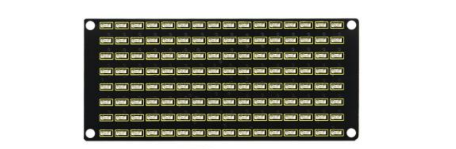

**1. Description**

If we add a 8x16 LED board to the robot, it will be amazing. Keyestudio's 8x16 dot matrix can meet your requirements. You can create facial emoticons, patterns or other interesting displays yourself. 8x16 LED light board comes with 128 LEDs. The data of the microprocessor (arduino) communicates with the AiP1640 through the two-wire bus interface, so as to control the 128 LEDs on the module, which produce the patterns you need on dot matrix. To facilitate wiring, we also provide a HX-2.54 4Pin wiring.

**2. Specification**

- Working voltage: DC 3.3-5V

- Power loss: 400mW

- Oscillation frequency: 450KHz

- Drive current: 200mA

- Working temperature: -40\~80℃

- Communication method: two-wire bus

**3. What You Need**

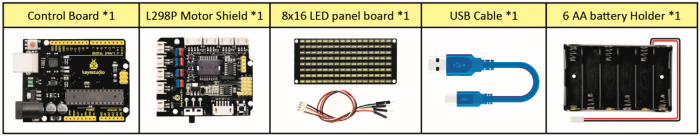

**4. 8x16 Dot Matrix Display**

Circuit Graph：

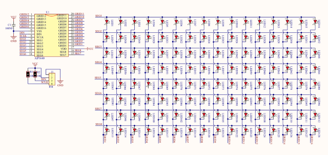

**The principle of 8x16 dot matrix:**

How to control each led light of 8x16 dot matrix? We know that a byte has 8 bits, each bit is 0 or 1. When a bit is 0, turn off LED and when a bit is 0, turn on LED. Thereby, one byte can control the LED in a row of dot matrix, so 16 bytes can control 16 columns of led lights, that is, 8x16 dot matrix.

**Interface Description and Communication Protocol:**

The data of the microprocessor (arduino) communicates with the AiP1640 through the two-wire bus interface.

The communication protocol diagram is shown below:

(SCLK) is SCL, (DIN) is SDA:

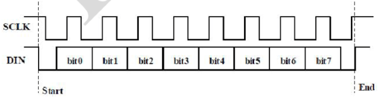

①The starting condition for data input: SCL is high level and SDA changes from high to low.

②For data command setting, there are methods as shown in the figure below

In our sample program, select the way to **add 1 to the address automatically**, the binary value is 0100 0000 and the corresponding hexadecimal value is 0x40.

| add 1 to the address automatically |
| ---------------------------------- |
| Fixed address                      |
| Universal mode                     |
| Test mode                          |

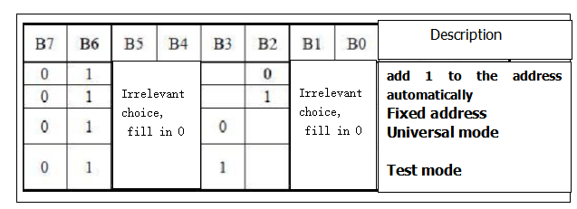

③For address command setting, the address can be selected as shown below.

The first 00H is selected in our sample program, and the binary number 1100 0000 corresponds to the hexadecimal 0xc0.

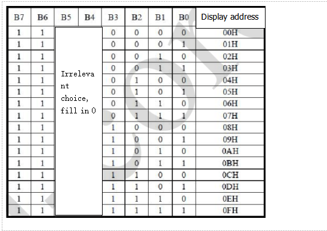

④The requirement for data input is that SCL is high level when inputting data, the signal on SDA must remain unchanged. Only when the clock signal on SCL is low level, the signal on SDA can be altered. The data input is low-order first, high-order is behind.

⑤ The condition to end data transmission is that when SCL is low, SDA is low, and when SCL is high, the SDA level also becomes high.

⑥ Display control, set different pulse width, the pulse width can be selected as shown below.

In the example, we choose pulse width 4/16, and the hexadecimal corresponds to 1000 1010 is 0x8A.

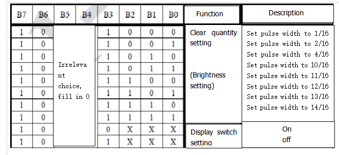

**5. Introduction for Modulus Tool**

The online version of dot matrix modulus tool: [http://dotmatrixtool.com/\#](http://dotmatrixtool.com/)

①Open the link to enter the following page.

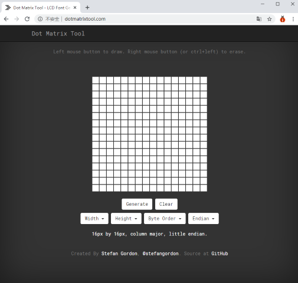

②The dot matrix is 8x16 in this project. So set the height to 8, width to 16, and select Big Endian; as shown below.

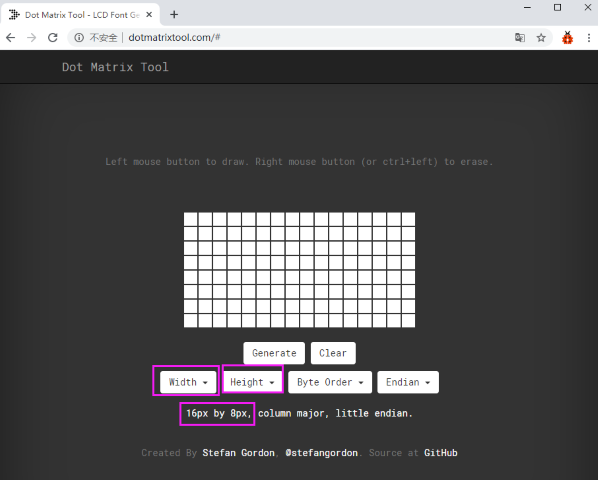

③ Generate hexadecimal data from the pattern

As shown below, the left button of the mouse is for selection while the right is for canceling. Thus you could use them to draw the pattern you want, then click **Generate**, to yield the hexadecimal data needed.

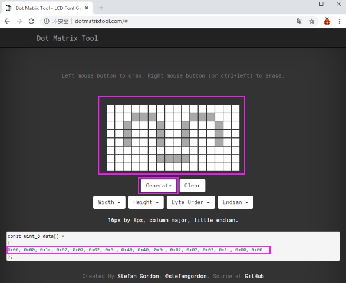

The generated hexadecimal code is what will be displayed, so you need to save it for next procedure.

**6. Connection Diagram**

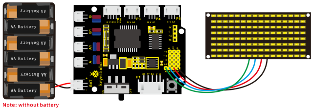

Wiring note: The GND, VCC, SDA, and SCL of the 8x16 LED panel are respectively connected to -(GND), + (VCC), A4 and A5 of the keyestudio sensor expansion board for two-wire serial communication. (Note: This pin is connected to Arduino IIC, but this module is not IIC communication, it can be linked with any two pins.)

**7. Test Code**

The code that shows smile face

```c
/*
keyestudio 4wd BT Car V2.0
lesson 4.1
matrix
http://www.keyestudio.com
*/ 
//get the data of smile pattern in the modulus tool
unsigned char smile[] = {0x00, 0x00, 0x1c, 0x02, 0x02, 0x02, 0x5c, 0x40, 0x40, 0x5c, 0x02, 0x02, 0x02, 0x1c, 0x00, 0x00};
#define SCL_Pin  A5  //Set clock pin to A5
#define SDA_Pin  A4  //Set data pin to A4

void setup()
{
    //Set pin to output
    pinMode(SCL_Pin,OUTPUT);
    pinMode(SDA_Pin,OUTPUT);
    //Clear the matrix display
    //matrix_display(clear);
}

void loop()
{
    matrix_display(smile);  //display smile pattern
}

//this function is used for dot matrix display
void matrix_display(unsigned char matrix_value[])
{
    IIC_start();  //the function to call the data transmission
    IIC_send(0xc0);  //Select address
    for(int i = 0;i < 16;i++) //Pattern data has 16 bytes
    {
        IIC_send(matrix_value[i]); //data to convey patterns
    }
    IIC_end();   //end the transmission of patterns data
    IIC_start();
    IIC_send(0x8A);  //display control, set pulse width to 4/16
    IIC_end();
}

//  the condition that data transmission starts
void IIC_start()
{
    digitalWrite(SCL_Pin,HIGH);
    delayMicroseconds(3);
    digitalWrite(SDA_Pin,HIGH);
    delayMicroseconds(3);
    digitalWrite(SDA_Pin,LOW);
    delayMicroseconds(3);
}

// transmit data
void IIC_send(unsigned char send_data)
{
    for(char i = 0;i < 8;i++)  //Every character has 8 bits
    {
        digitalWrite(SCL_Pin,LOW);  //pull down the SCL_Pin to change the signal of SDA
        delayMicroseconds(3);
        if(send_data & 0x01)  //1 or 0 of byte  is used to set high and low level of SDA_Pin
        {
        	digitalWrite(SDA_Pin,HIGH);
        }
        else
        {
        	digitalWrite(SDA_Pin,LOW);
        }
        delayMicroseconds(3);
        digitalWrite(SCL_Pin,HIGH); //Pull up SCL_Pin to stop data transmission
        delayMicroseconds(3);
        send_data = send_data >> 1;  //Detect bit by bit, so move the data right by one bit
    }
}

//the sign that data transmission ends 
void IIC_end()
{
    digitalWrite(SCL_Pin,LOW);
    delayMicroseconds(3);
    digitalWrite(SDA_Pin,LOW);
    delayMicroseconds(3);
    digitalWrite(SCL_Pin,HIGH);
    delayMicroseconds(3);
    digitalWrite(SDA_Pin,HIGH);
    delayMicroseconds(3);
}
```

**8. Test Result**

After uploading code on keyestudio V4.0 development board, hook up by the connection diagram, the DIP switch is dialed to right end, then a smile pattern is shown.


**9. Extension Practice**

We use the modulo tool([http://dotmatrixtool.com/\#](http://dotmatrixtool.com/))to make the dot matrix alternately display start, forward and stop patterns then clear the patterns, and the time interval is 2000 milliseconds.

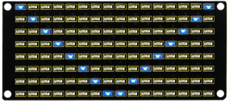

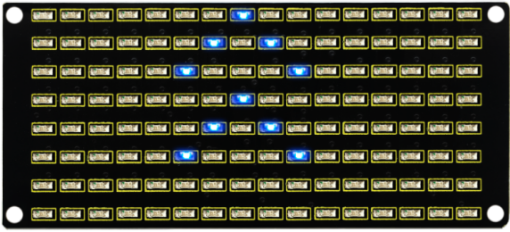

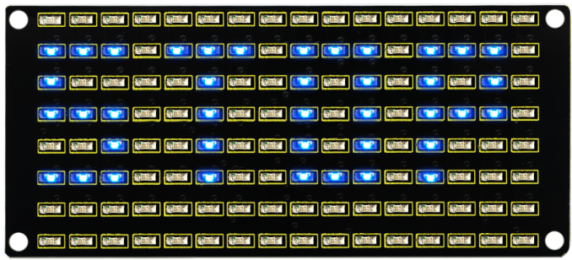

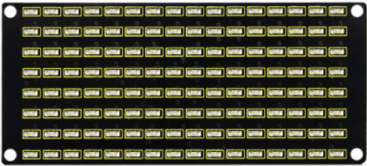

Get the graphical code to be displayed via modulus tool

xxStart  : xx0x01,0x02,0x04,0x08,0x10,0x20,0x40,0x80,0x80,0x40,0x20,0x10,0x08,0x04,0x02,0x01

**Go front：**

0x00,0x00,0x00,0x00,0x00,0x24,0x12,0x09,0x12,0x24,0x00,0x00,0x00,0x00,0x00,0x00

**Go back：**

0x00,0x00,0x00,0x00,0x00,0x24,0x48,0x90,0x48,0x24,0x00,0x00,0x00,0x00,0x00,0x00

**Turn left：**

0x00,0x00,0x00,0x00,0x00,0x00,0x44,0x28,0x10,0x44,0x28,0x10,0x44,0x28,0x10,0x00

**Turn right:**

0x00,0x10,0x28,0x44,0x10,0x28,0x44,0x10,0x28,0x44,0x00,0x00,0x00,0x00,0x00,0x00

**Stop：**

0x2E,0x2A,0x3A,0x00,0x02,0x3E,0x02,0x00,0x3E,0x22,0x3E,0x00,0x3E,0x0A,0x0E,0x00

Clear the matrix display:

0x00,0x00,0x00,0x00,0x00,0x00,0x00,0x00,0x00,0x00,0x00,0x00,0x00,0x00,0x00,0x00

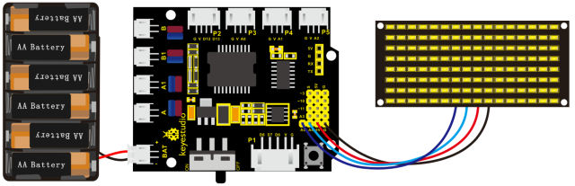

The code that the multiple patterns shift:

```c
/*
keyestudio 4WD Robot v2.0
lesson 4.2
matrix
http://www.keyestudio.com
*/ 
//Array, used to store the data of pattern, can be calculated by yourself or obtained from the modulus tool
unsigned char start01[] ={0x01,0x02,0x04,0x08,0x10,0x20,0x40,0x80,0x80,0x40,0x20,0x10,0x08,0x04,0x02,0x01};
unsigned char front[] = {0x00,0x00,0x00,0x00,0x00,0x24,0x12,0x09,0x12,0x24,0x00,0x00,0x00,0x00,0x00,0x00};
unsigned char back[] = {0x00,0x00,0x00,0x00,0x00,0x24,0x48,0x90,0x48,0x24,0x00,0x00,0x00,0x00,0x00,0x00};
unsigned char left[] = {0x00,0x00,0x00,0x00,0x00,0x00,0x44,0x28,0x10,0x44,0x28,0x10,0x44,0x28,0x10,0x00};
unsigned char right[] = {0x00,0x10,0x28,0x44,0x10,0x28,0x44,0x10,0x28,0x44,0x00,0x00,0x00,0x00,0x00,0x00};
unsigned char STOP01[] = {0x2E,0x2A,0x3A,0x00,0x02,0x3E,0x02,0x00,0x3E,0x22,0x3E,0x00,0x3E,0x0A,0x0E,0x00};
unsigned char clear[] = {0x00,0x00,0x00,0x00,0x00,0x00,0x00,0x00,0x00,0x00,0x00,0x00,0x00,0x00,0x00,0x00};
#define SCL_Pin  A5  //Set clock pin to A5
#define SDA_Pin  A4  //Set data pin to A4

void setup()
{
    //Set pin to output
    pinMode(SCL_Pin,OUTPUT);
    pinMode(SDA_Pin,OUTPUT);
    //Clear the matrix display
    matrix_display(clear);
}

void loop()
{
    matrix_display(start01);  //Display start pattern
    delay(2000);
    matrix_display(front);    ///Front pattern
    delay(2000);
    matrix_display(STOP01);   //Stop pattern
    delay(2000);
    matrix_display(clear);    //Clear the matrix display
    delay(2000);
}

//this function is used for dot matrix display
void matrix_display(unsigned char matrix_value[])
{
    IIC_start();  //the function to call the data transmission
    IIC_send(0xc0);  //Select address
    for(int i = 0;i < 16;i++) //Pattern data has 16 bytes
    {
        IIC_send(matrix_value[i]); //data to convey patterns
    }
    IIC_end();   //end the transmission of patterns data
    IIC_start();
    IIC_send(0x8A);  //display control, set pulse width to 4/16
    IIC_end();
}

//  the condition that data transmission starts
void IIC_start()
{
    digitalWrite(SCL_Pin,HIGH);
    delayMicroseconds(3);
    digitalWrite(SDA_Pin,HIGH);
    delayMicroseconds(3);
    digitalWrite(SDA_Pin,LOW);
    delayMicroseconds(3);
}

// transmit data
void IIC_send(unsigned char send_data)
{
    for(char i = 0;i < 8;i++)  //Every character has 8 bits
    {
        digitalWrite(SCL_Pin,LOW);  //pull down the SCL_Pin to change the signal of SDA
        delayMicroseconds(3);
        if(send_data & 0x01)  //1 or 0 of byte  is used to set high and low level of SDA_Pin
        {
        	digitalWrite(SDA_Pin,HIGH);
        }
        else
        {
        	digitalWrite(SDA_Pin,LOW);
        }
        delayMicroseconds(3);
        digitalWrite(SCL_Pin,HIGH); //Pull up SCL_Pin to stop data transmission
        delayMicroseconds(3);
        send_data = send_data >> 1;  //Detect bit by bit, so move the data right by one bit
    }
}
//the sign that data transmission ends
void IIC_end()
{
    digitalWrite(SCL_Pin,LOW);
    delayMicroseconds(3);
    digitalWrite(SDA_Pin,LOW);
    delayMicroseconds(3);
    digitalWrite(SCL_Pin,HIGH);
    delayMicroseconds(3);
    digitalWrite(SDA_Pin,HIGH);
    delayMicroseconds(3);
} 
```

Upload code on development board, 8\*16 dot matrix display shows front, back and stop patterns, alternately.

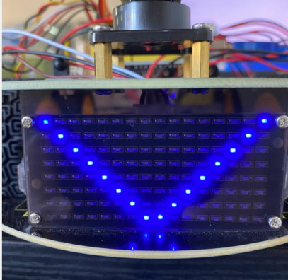

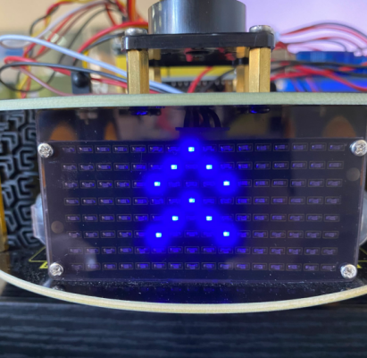

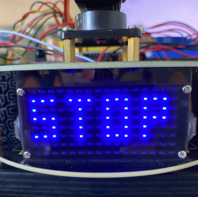