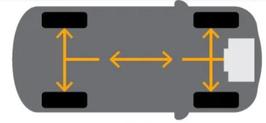
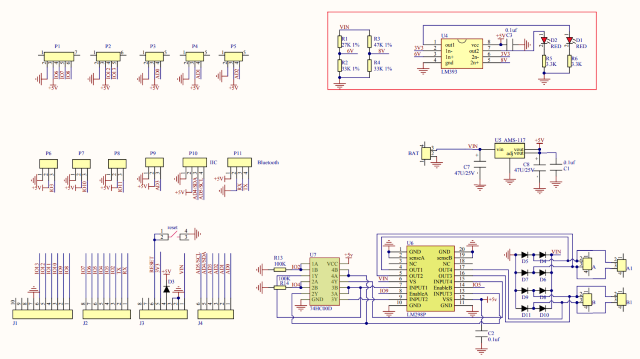
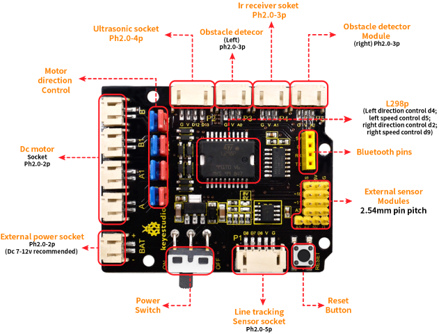
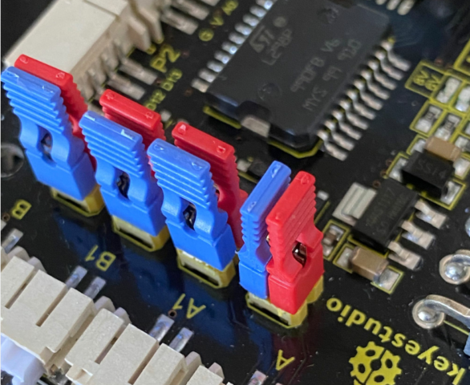
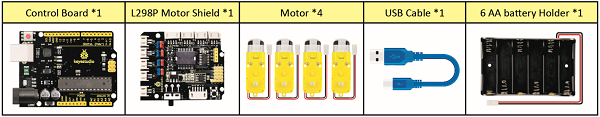
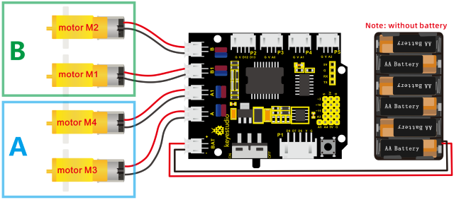

### Project 5 Drive Robot



**1. Description**

There are many ways to drive a motor. Our robot car uses the most common solution--L298P--which is an excellent high-power motor driver IC produced by STMicroelectronics. It can directly drive DC motors, two-phase and four-phase stepping motors. The driving current is up to 2A, and the output terminal of motor adopts eight high-speed Schottky diodes as protection.

We designed a shield based on the circuit of L298p.

The stacked design reduces the technical difficulty of using and driving the motor.





**2. Specification**

Circuit Diagram for L298P Board

1.  Logic part input voltage: DC5V
2.  Driving part input voltage: DC 7-12V
3.  Logic part working current: \< 36mA
4.  Driving part working current: \< 2A
5.  Maximum power dissipation: 25W (T=75℃)
6.  Working temperature: -25℃～＋130℃
7.  Control signal input level: high level 2.3V\< Vin\< 5V, low level-0.3V\< Vin\< 1.5V

**3. Drive Robot to Move**

The driver of motor driver shield is in parallel connection. You could control the direction of motors by altering the orientation of jumper caps(seen in the picture).



From the above diagram, it is known that the direction pin of B motor is D4; speed pin is D5; D2 is the direction pin of A motor; and D9 is speed pin.

**<span style="color: rgb(255, 76, 65);">Special Note: </span> **

**1.The control pins of the motor cannot be modified during programming, otherwise the development board will not be able to control the motor.** 

**2.Note that the red and blue 8 jumper caps must all be installed on the expansion board.**

PWM decides 2 motors to rotate so as to drive robot car. The PWM value is in the range of 0-255. The larger the number, the faster the rotation of the motor.

| **4WD** **Robot** | **Motor (A)**      | **Motor (B)**      |
| ----------------- | ------------------ | ------------------ |
| Forward           | Turn clockwise     |                    |
| Backward          | Turn anticlockwise |                    |
| Rotate to left    | Turn anticlockwise | Turn clockwise     |
| Rotate to right   | Turn clockwise     | Turn anticlockwise |
| Stop              | Stop               | Stop               |

**4. What You Need**



**5. Connection Diagram**



**Attention: please connect motors in compliance with the above connection diagram**

**6. Test Code**

```c
/*
keyestudio 4wd BT Car V2.0
lesson 5.1
motor driver shield
http://www.keyestudio.com
*/ 
#define ML_Ctrl 4     // define the direction control pin of B motor
#define ML_PWM 5      //define the PWM control pin of B motor
#define MR_Ctrl 2     //define direction control pin of A motor
#define MR_PWM 6      //define the PWM control pin of A motor

void setup()
{
    pinMode(ML_Ctrl, OUTPUT); //define direction control pin of B motor as output
    pinMode(ML_PWM, OUTPUT);  //define PWM control pin of B motor as output
    pinMode(MR_Ctrl, OUTPUT); //define direction control pin of A motor as output.
    pinMode(MR_PWM, OUTPUT); //define the PWM control pin of A motor as output
}

void loop()
{ 
    digitalWrite(ML_Ctrl,HIGH); //set the direction control pin of B motor to HIGH
    analogWrite(ML_PWM,200);    //set the PWM control speed of B motor to 200
    digitalWrite(MR_Ctrl,HIGH); //set the direction control pin of A motor to HIGH
    analogWrite(MR_PWM,200);    //set the PWM control speed of A motor to 200
    
    //front
    delay(2000);//delay in 2s
    digitalWrite(ML_Ctrl,LOW);  //set the direction control pin of B motor to LOW
    analogWrite(ML_PWM,200);    //set the PWM control speed of B motor to 200  
    digitalWrite(MR_Ctrl,LOW);  //set the direction control pin of A motor to LOW
    analogWrite(MR_PWM,200);    //set the PWM control speed of A motor to 200
    
    //back
    delay(2000);//delay in 2s 
    digitalWrite(ML_Ctrl,LOW);  //set the direction control pin of B motor to LOW
    analogWrite(ML_PWM,200);    //set the PWM control speed of B motor to 200
    digitalWrite(MR_Ctrl,HIGH); //set the direction control pin of A motor to HIGH
    analogWrite(MR_PWM,200);    //set the PWM control speed of A motor to 200

    //left
    delay(2000);//delay in 2s
    digitalWrite(ML_Ctrl,HIGH); //set the direction control pin of B motor to HIGH
    analogWrite(ML_PWM,200);    //set the PWM control speed of B motor to 200
    digitalWrite(MR_Ctrl,LOW);  // set the direction control pin of A motor to LOW
    analogWrite(MR_PWM,200);    //set the PWM control speed of A motor to 200

    //right
    delay(2000);                //delay in 2s
    analogWrite(ML_PWM,0);      //set the PWM control speed of B motor to 0
    analogWrite(MR_PWM,0);      //set the PWM control speed of A motor to 0

    //stop
    delay(2000);                //delay in 2s
}
```

**7. Test Result**

Hook up by connection diagram, upload code and power on, smart car goes forward and back for 2s, turns left and right for 2s, and stops for 2s alternately.

**8. Code Explanation**

**digitalWrite(ML_Ctrl,LOW):** the rotation direction of motor is decided by the high/low level and and the pins that decide rotation direction are digital pins.

**analogWrite(ML_PWM,200):** the speed of motor is regulated by PWM, and the pins that decide the speed of motor must be PWM pins.

**9. Extension Practice**

Adjust the speed that PWM controls the motor, hook up in same way.


```c
/*
keyestudio 4wd BT Car V2.0
lesson 5.2
motor driver
http://www.keyestudio.com
*/ 
#define ML_Ctrl 4     //define the direction control pin of B motor
#define ML_PWM 5   //define the PWM control pin of B motor
#define MR_Ctrl 2    //define the direction control pin of A motor
#define MR_PWM 6   //define the PWM control pin of A motor

void setup()
{
    pinMode(ML_Ctrl, OUTPUT);//set direction control pin of B motor to OUTPUT
    pinMode(ML_PWM, OUTPUT);//set the PWM control pin of B motor to OUTPUT 
    pinMode(MR_Ctrl, OUTPUT);//set the direction control pin of A motor to OUTPUT
    pinMode(MR_PWM, OUTPUT);//set PWM control pin of A motor to OUTPUT
}

void loop()
{ 
    digitalWrite(ML_Ctrl,HIGH);//set direction control pin of B motor to HIGH level
    analogWrite(ML_PWM,250);//Set PWM control speed of B motor to 100
    digitalWrite(MR_Ctrl,HIGH);//set direction control pin of A motor to HIGH level
    analogWrite(MR_PWM,250);//Set PWM control speed of A motor to 100
    //front
    delay(2000);//delay in 2s
    digitalWrite(ML_Ctrl,LOW);//set direction control pin of B motor to LOW
    analogWrite(ML_PWM,250);//Set PWM control speed of B motor to 100
    digitalWrite(MR_Ctrl,LOW);//set direction control pin of A motor to LOW
    analogWrite(MR_PWM,250);//Set PWM control speed of A motor to 100
    //back
    delay(2000);//delay in 2s
    digitalWrite(ML_Ctrl,LOW);//set direction control pin of B motor to LOW
    analogWrite(ML_PWM,250);//Set PWM control speed of B motor to 100
    digitalWrite(MR_Ctrl,HIGH);//set direction control pin of A motor to HIGH level
    analogWrite(MR_PWM,250);//Set PWM control speed of A motor to 100
    //left
    delay(2000);//delay in 2s
    digitalWrite(ML_Ctrl,HIGH);//set direction control pin of B motor to HIGH level
    analogWrite(ML_PWM,250);//Set PWM control speed of B motor to 100
    digitalWrite(MR_Ctrl,LOW);//set direction control pin of A motor to LOW
    analogWrite(MR_PWM,250);//Set PWM control speed of A motor to 100
    //right
    delay(2000);//delay in 2s
    analogWrite(ML_PWM,0);//set PWM control speed of B motor to 0
    analogWrite(MR_PWM,0);//set PWM control speed of A motor to 0
    //stop
    delay(2000);//delay in 2s
}
```

After uploading the code successfully, do you find the motors rotate faster?