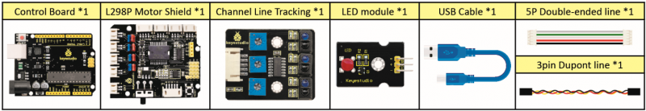
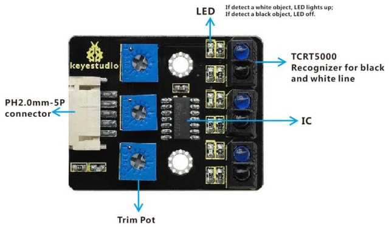
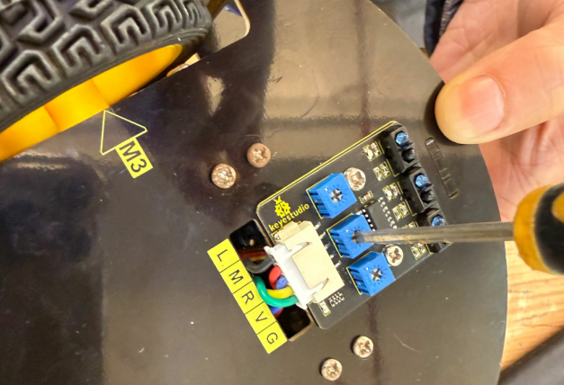
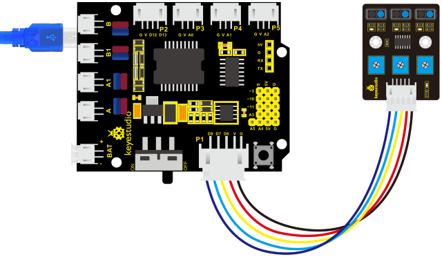
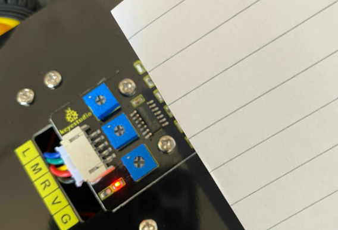
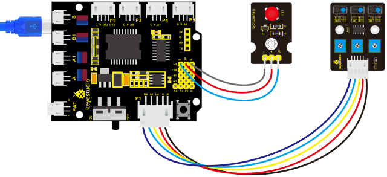

### Project 6  Line Tracking Sensor

**1. Description**


The tracking sensor is actually an infrared sensor. The component used here is the TCRT5000 infrared tube.

Its working principle is to use different reflectivity of infrared light to colors, then convert the strength of the reflected signal into a current signal.

During the process of detection, black is active at HIGH level while white is active at LOW level. The detection height is 0-3 cm.

Keyestudio 3-channel line tracking module has integrated 3 sets of TCRT5000 infrared tube on a single board, which is more convenient for wiring and control.

By rotating the adjustable potentiometer on the sensor, it can adjust the detection sensitivity of the sensor.

**2. Specification**

- Operating Voltage: 3.3-5V (DC)

- Interface: 5PIN

- Output Signal: Digital signal

- Detection Height: 0-3 cm

**3. What You Need**





Special note: before testing, turn the potentiometer on the sensor to adjust the detection sensitivity. When adjust the LED at the threshold between ON and OFF, the sensitivity is the best.



**4. Connection Diagram**



**5. Test Code**

```c
/*
keyestudio 4wd BT Car V2
lesson 6.1
    Line Track sensor
    http://www.keyestudio.com
*/
int L_pin = 11;  //pins of  left line tracking sensor
int M_pin = 7;  //pins of  middle line tracking sensor
int R_pin = 8;  //pins of  right  line tracking sensor
int val_L,val_R,val_M;// define these variables

void setup()
{
    Serial.begin(9600); // initialize serial communication at 9600 bits per second
    pinMode(L_pin,INPUT); // make the L_pin as an input
    pinMode(M_pin,INPUT); // make the M_pin as an input
    pinMode(R_pin,INPUT); // make the R_pin as an input
}

void loop() 
{ 
    val_L = digitalRead(L_pin);//read the L_pin:
    val_R = digitalRead(R_pin);//read the R_pin:
    val_M = digitalRead(M_pin);//read the M_pin:
    Serial.print("left:");
    Serial.print(val_L);
    Serial.print(" middle:");
    Serial.print(val_M);
    Serial.print(" right:");
    Serial.println(val_R);
    delay(500);// delay in between reads for stability
}
```

**6. Test Result**

Upload the code on development board, open serial monitor to check line tracking sensors. And the displayed value is 1(high level) when no signals are received. The value shifts into 0 when the sensor is covered with paper.




**7. Code Explanation**

**Serial.begin(9600)**- Initialize serial port, set baud rate to 9600

**pinMode-** Define the pin as input or output mode

xxdigitalRead-xxRead the state of pin, which are generally HIGH and LOW level

**8. Extension Practice**

After knowing its working principle, you can connect an LED to D3. so as to control LED by line tracking sensor.



**9. Test Code**

```c
/*
keyestudio 4wd BT Car V2
lesson 6.2
    Line Track sensor
    http://www.keyestudio.com
*/
int L_pin = 11;  //pins of  left line tracking sensor
int M_pin = 7;  //pins of  middle line tracking sensor
int R_pin = 8;  //pins of  right  line tracking sensor
int val_L,val_R,val_M;// define the variables of three sensors 

void setup()
{
    Serial.begin(9600); // initialize serial communication at 9600 bits per second
    pinMode(L_pin,INPUT); // make the L_pin as an input
    pinMode(M_pin,INPUT); // make the M_pin as an input
    pinMode(R_pin,INPUT); // make the R_pin as an input
    pinMode(9, OUTPUT);
}

void loop() 
{ 
    val_L = digitalRead(L_pin);//read the L_pin:
    val_R = digitalRead(R_pin);//read the R_pin:
    val_M = digitalRead(M_pin);//read the M_pin:
    Serial.print("left:");
    Serial.print(val_L);
    Serial.print(" middle:");
    Serial.print(val_M);
    Serial.print(" right:");
    Serial.println(val_R);

    if (val_L == HIGH)//if left line tracking sensor detects signals
    { 
    	digitalWrite(9, LOW);//LED is off
    } 
    else//if left line tracking sensor doesn’t detect signals
    { 
        digitalWrite(9, HIGH);//LED lights up
        delay(2000); 
    }
    
    if (val_R == HIGH)//if right line tracking sensor detects signals
    {
    	digitalWrite(9, LOW);//LED is off
    }
    else//if right line tracking sensor doesn’t detect signals
    {
        digitalWrite(9, HIGH);//LED lights up
        delay(2000); 
    }
    
    if (val_M == HIGH)//if middle line tracking sensor detects signals
    {
    	digitalWrite(9, LOW);//LED is off
    }
    else//if middle line tracking sensor doesn’t detect signals
    {
        digitalWrite(9, HIGH);//LED lights up
        delay(2000); 
    }
}
```

Upload the code to development board, we could observe the brightness of LED when covering the line tracking sensor or getting close to it by hand.