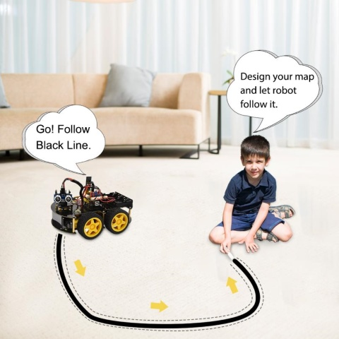
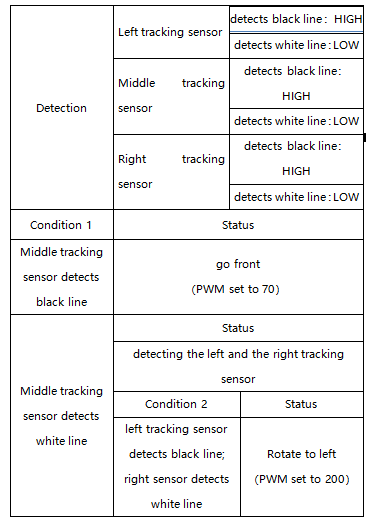
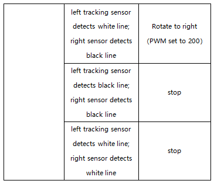
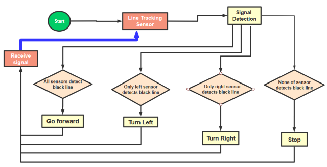
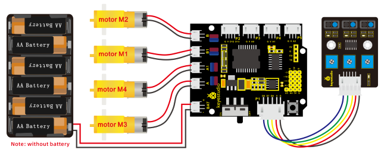

### Project 7 Line Tracking Robot



**1. Description**

The previous projects are inclusive of the knowledge of multiple sensors and modules. Next, we will work on a little challenging task.

Based on the working principle of the line tracking sensor we could make a line tracking car.

Line tracking robot car:





Flow Chart



**2. Connection Diagram**



**3. Test Code**

```c
/*
keyestudio 4wd BT Car V2.0
lesson 7
Line Tracking Robot
http://www.keyestudio.com
*/ 
#define ML_Ctrl 4     //define direction control pin of B motor
#define ML_PWM 5   //define PWM control pin of B motor
#define MR_Ctrl 2    //define direction control pin of A motor
#define MR_PWM 6   //define PWM control pin of A motor
const int sensor_l = 11;//define the pin of left line tracking sensor
const int sensor_c = 7;//define the pin of middle line tracking sensor
const int sensor_r = 8;//define the pin of right line tracking sensor
int l_val,c_val,r_val;//define these variables

void setup() 
{
    Serial.begin(9600);//start serial monitor and set baud rate to 9600
    pinMode(ML_Ctrl, OUTPUT);//set direction control pin of B motor 
    pinMode(ML_PWM, OUTPUT);//set PWM control pin of B motor to OUTPUT
    pinMode(MR_Ctrl, OUTPUT);//set direction control pin of A motor to OUTPUT
    pinMode(MR_PWM, OUTPUT);//set PWM control pin of A motor to OUTPUT
    pinMode(sensor_l,INPUT);//set the pins of left line tracking sensor to INPUT
    pinMode(sensor_c,INPUT);//set the pins of middle line tracking sensor to INPUT
    pinMode(sensor_r,INPUT);//set the pins of right line tracking sensor to INPUT
}

void loop() 
{
    tracking(); //run main program
}

void tracking()
{
    l_val = digitalRead(sensor_l);//read the value of left line tracking sensor
    c_val = digitalRead(sensor_c);//read the value of middle line tracking sensor
    r_val = digitalRead(sensor_r);//read the value of right line tracking sensor
    if(c_val == 1)//if the state of middle one is 1, which means detecting black line
    {
    front();//car goes forward
    }
    else
    {
    if((l_val == 1)&&(r_val == 0))//if only left line tracking sensor detects black trace
    {
        left();//car turns left
    }
else if((l_val == 0)&&(r_val == 1))//if only right line tracking sensor detects black trace
    {
        right();//car turns right
    }
    else// if left and right line tracking sensors detect black trace or they don’t read
    {
        Stop();//car stops
    }
    }
}

void front()//define the status of going forward
{
    digitalWrite(ML_Ctrl,HIGH);//set direction control pin of B motor to HIGH
    analogWrite(ML_PWM,70);//set PWM control speed of B motor to 70
    digitalWrite(MR_Ctrl,HIGH);//set direction control pin of A motor to HIGH 
    analogWrite(MR_PWM,70);//set PWM control speed of A motor to 70
}

void back()//define the state of going back
{
    digitalWrite(ML_Ctrl,LOW);//set direction control pin of B motor to LOW
    analogWrite(ML_PWM,200);//set PWM control speed of B motor to 200
    digitalWrite(MR_Ctrl,LOW);//set direction control pin of A motor to LOW
    analogWrite(MR_PWM,200);//set PWM control speed of A motor to 200
}

void left()//car turns left
{
    digitalWrite(ML_Ctrl,LOW);//set direction control pin of B motor to LOW
    analogWrite(ML_PWM,200);//set PWM control speed of B motor to 200
    digitalWrite(MR_Ctrl,HIGH);//set direction control pin of A motor to HIGH level
    analogWrite(MR_PWM,200);//set PWM control speed of A motor to 200
}

void right()//define the right-turning state
{
    digitalWrite(ML_Ctrl,HIGH);//set direction control pin of B motor to HIGH level
    analogWrite(ML_PWM,200);//set PWM control speed of B motor to 200
    digitalWrite(MR_Ctrl,LOW);//set direction control pin of A motor to LOW
    analogWrite(MR_PWM,200);//set PWM control speed of A motor to 200
}

void Stop()//define the state of stop
{
    analogWrite(ML_PWM,0);//set PWM control speed of B motor to 0
    analogWrite(MR_PWM,0);//set PWM control speed of A motor to 0
}
```

**4. Test Result**

Upload the code on the keyestudio V4.0 board successfully. Stack the expansion board on the keyestudio V4.0 board and wire it according to connection diagram. After power-on, the DIP switch will be dialed to the “ON” end, and the smart car can walk along the black line.