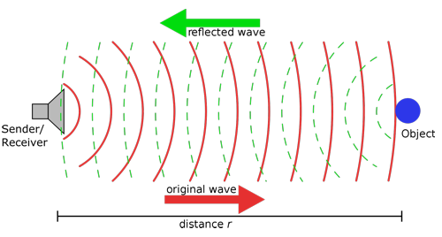
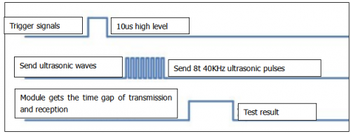
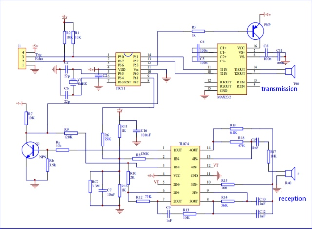
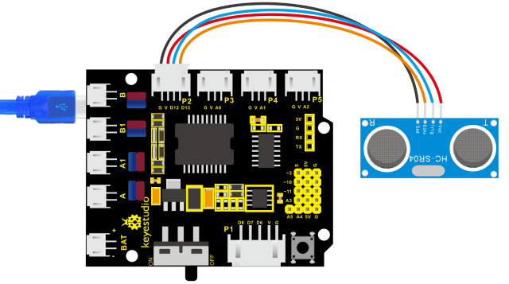
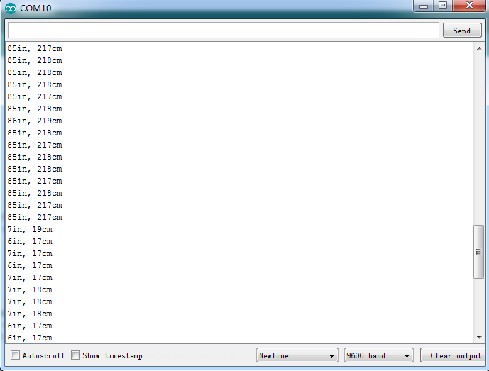
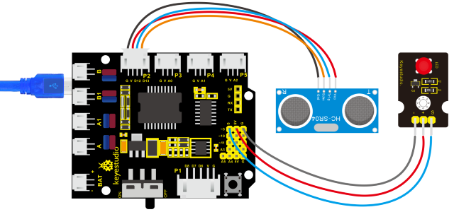

### Project 8 Ultrasonic Sensor

**1. Description**



The HC-SR04 ultrasonic sensor uses sonar to determine distance to an object like what bats do. It offers excellent non-contact range detection with high accuracy and stable readings in an easy-to-use package. It comes complete with ultrasonic transmitter and receiver modules.

The HC-SR04 or the ultrasonic sensor is being used in a wide range of electronics projects for creating obstacle detection and distance measuring application as well as various other applications. Here we have brought the simple method to measure the distance with arduino and ultrasonic sensor and how to use ultrasonic sensor with arduino.

**2. Specification**

- Power Supply :+5V DC

- Quiescent Current : \< 2mA

- Working Current: 15mA

- Effectual Angle: \< 15°

- Ranging Distance : 2cm – 400 cm

- Resolution : 0.3 cm

- Measuring Angle: 30 degree

- Trigger Input Pulse width: 10uS

**3. The principle of ultrasonic sensor**

As the above picture shown, it is like two eyes. One is transmitting end, the other is receiving end.

The ultrasonic module will emit the ultrasonic waves after triggering a signal. When the ultrasonic waves encounter the object and are reflected back, the module outputs an echo signal, so it can determine the distance of the object from the time difference between the trigger signal and echo signal.

The t is the time that emitting signal meets obstacle and returns. And the propagation speed of sound in the air is about 343m/s, and distance = speed x time. However, the ultrasonic wave emits and comes back, which is 2 times of distance.

Therefore, it needs to be divided by 2, the distance measured by ultrasonic wave = (speed x time)/2

1.  Use method and timing chart of ultrasonic module:
2.  Setting the delay time of Trig pin of SR04 to 10μs at least, which can trigger it to detect distance.
3.  After triggering, the module will automatically send eight 40KHz ultrasonic pulses and detect whether there is a signal return. This step will be completed automatically by the module.
4.  If the signal returns, the Echo pin will output a high level, and the duration of the high level is the time from the transmission of the ultrasonic wave to the return.



Circuit diagram of ultrasonic sensor:



**4. Connection Diagram**



Wiring guide:

- Ultrasonic sensor keyestudio V5 Sensor Shield

- VCC → 5v(V)

- Trig → 12(S)

- Echo → 13(S)

- Gnd → Gnd(G)

**5. Test Code**

```c
/*
    keyestudio 4wd BT Car V2
    lesson 8.1
    Ultrasonic sensor
    http://www.keyestudio.com
*/ 
int trigPin = 12;    // Trigger
int echoPin = 13;    // Echo
long duration, cm, inches;

void setup() 
{
    //Serial Port begin
    Serial.begin (9600);
    //Define inputs and outputs
    pinMode(trigPin, OUTPUT);
    pinMode(echoPin, INPUT);
}

void loop() 
{
    // The sensor is triggered by a HIGH pulse of 10 or more microseconds.
    // Give a short LOW pulse beforehand to ensure a clean HIGH pulse:
    digitalWrite(trigPin, LOW);
    delayMicroseconds(2);
    digitalWrite(trigPin, HIGH);
    delayMicroseconds(10);
    digitalWrite(trigPin, LOW);
    // Read the signal from the sensor: a HIGH pulse whose
    // duration is the time (in microseconds) from the sending
    // of the ping to the reception of its echo off of an object.
    duration = pulseIn(echoPin, HIGH);
    // Convert the time into a distance
    cm = (duration/2) / 29.1;     // Divide by 29.1 or multiply by 0.0343
    inches = (duration/2) / 74;   // Divide by 74 or multiply by 0.0135
    Serial.print(inches);
    Serial.print("in, ");
    Serial.print(cm);
    Serial.print("cm");
    Serial.println();
    delay(50);
}   
```

**7. Test Result**

Upload test code on the development board, open serial monitor and set baud rate to 9600. The detected distance will be displayed, and the unit is cm and inch. Hinder the ultrasonic sensor by hand, the displayed distance value gets smaller.



**7. Code Explanation**

**int trigPin-** this pin is defined to transmit ultrasonic waves, generally output.

**int echoPin -** this is defined as the pin of reception, generally input

cm = (duration/2) / 29.1-unit is cm

inches = (duration/2) / 74-unit is inch

We can calculate the distance by using the following formula:

distance = (traveltime/2) x speed of sound

The speed of sound is: 343m/s = 0.0343 cm/uS = 1/29.1 cm/uS

Or in inches: 13503.9in/s = 0.0135in/uS = 1/74in/uS

We need to divide the traveltime by 2 because we have to take into account that the wave was sent, hit the object, and then returned back to the sensor.

**9. Extension Practice**

We have just measured the distance displayed by the ultrasonic. How about controlling the LED with the measured distance? Let's try it and connect an LED light module to the D3 pin.



```c
/*
    keyestudio 4wd BT Car V2
    lesson 8.2
    Ultrasonic LED
    http://www.keyestudio.com
*/ 
int trigPin = 12;    // Trigger
int echoPin = 13;    // Echo
long duration, cm, inches;

void setup() 
{
    Serial.begin (9600);       //Serial Port begin
    pinMode(trigPin, OUTPUT);  //Define inputs and outputs
    pinMode(echoPin, INPUT);
    pinMode(9, OUTPUT);
}

void loop() 
{
    // The sensor is triggered by a HIGH pulse of 10 or more microseconds.
    // Give a short LOW pulse beforehand to ensure a clean HIGH pulse:
    digitalWrite(trigPin, LOW);
    delayMicroseconds(2);
    digitalWrite(trigPin, HIGH);
    delayMicroseconds(10);
    digitalWrite(trigPin, LOW);
    // Read the signal from the sensor: a HIGH pulse whose
    // duration is the time (in microseconds) from the sending
    // of the ping to the reception of its echo off of an object.
    duration = pulseIn(echoPin, HIGH);
    // Convert the time into a distance
    cm = (duration/2) / 29.1;     // Divide by 29.1 or multiply by 0.0343
    inches = (duration/2) / 74;   // Divide by 74 or multiply by 0.0135
    Serial.print(inches);
    Serial.print("in, ");
    Serial.print(cm);
    Serial.print("cm");
    Serial.println();
    delay(50);
	if (cm>=2 && cm<=10)
		digitalWrite(9, HIGH);
	else 
		digitalWrite(9, LOW);
}
```

Upload test code to development board and block ultrasonic sensor by hand, then check if LED is on.