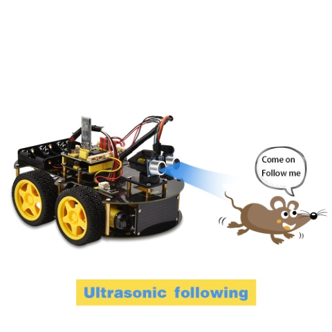
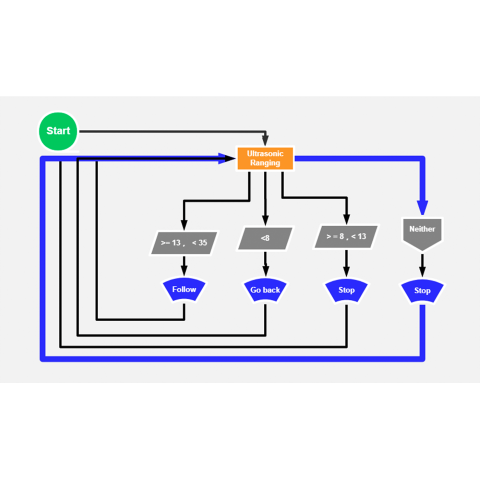
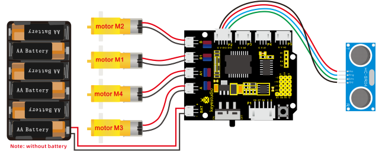

### Project 9 Ultrasonic Follow Robot



**1. Description**

We can combine the hardware knowledge of various sensors, modules, motor drives to build an ultrasonic following robot car!

In the circuit process, we can make use of ultrasonic sensors to detect the distance between a robot car and obstacles so as to control the robot car to move by the measured distance . And dot matrix shows a smile facial pattern.

The specific logic of ultrasonic follow robot car is shown below:

| Detection | Measured distance of front obstacles |
| --------- | ------------------------------------ |
| Condition | Distance＜8                          |
| Status    | Go back（PWM set to 100）            |
| Condition | distance≥8 and distance＜13          |
| Status    | Stop                                 |
| Condition | distance≥13 and distance＜35         |
| Status    | Go front（PWM set to 100）           |
| Condition | distance≥35                          |
| Status    | stop                                 |

Distance（unit：cm）

**2. Flow Chart**



**3. Hook-up Diagram**



**4. Test Code**

```c
/*
keyestudio 4wd BT Car V2.0
lesson 9
Ultrasonic Follow Robot
http://www.keyestudio.com
*/ 
#define ML_Ctrl 4     //define direction control pin of B motor
#define ML_PWM 5   //define PWM control pin of B motor
#define MR_Ctrl 2    //define direction control pin of A motor
#define MR_PWM 6   //define PWM control pin of A motor
#include "SR04.h" //define the function library of ultrasonic sensor
#define TRIG_PIN 12// set the signal input of ultrasonic sensor to D12 
#define ECHO_PIN 13//set the signal output of ultrasonic sensor to D13
SR04 sr04 = SR04(ECHO_PIN,TRIG_PIN);
long distance;

void setup() 
{
    Serial.begin(9600);//open serial monitor and set baud rate to 9600
    pinMode(ML_Ctrl, OUTPUT);//set direction control pin of B motor to OUTPUT
    pinMode(ML_PWM, OUTPUT);//set PWM control pin of B motor to OUTPUT
    pinMode(MR_Ctrl, OUTPUT);//set direction control pin of A motor to OUTPUT
    pinMode(MR_PWM, OUTPUT);//set PWM control pin of A motor to OUTPUT
    pinMode(TRIG_PIN,OUTPUT);// set TRIG_PIN to OUTPUT
    pinMode(ECHO_PIN,INPUT);// set ECHO_PIN to INPUT
}

void loop() 
{
    distance = sr04.Distance();// the distance detected by ultrasonic sensor
    if(distance<8)//if distance is less than 8
    {
    	back();//go back
    }
    else if((distance>=8)&&(distance<13))// if 8≤distance＜13
    {
    	Stop();//stop
    }
    else if((distance>=13)&&(distance<35))//if 13≤distance＜35
    {
    	front();//follow
    }
    else//otherwise
    {
    	Stop();//stop
    }
}

void front()//go front 
{
    digitalWrite(ML_Ctrl,HIGH);//set direction control pin of B motor to HIGH
    analogWrite(ML_PWM,100);//Set PWM control speed of B motor to 100
    digitalWrite(MR_Ctrl,HIGH);//set direction control pin of A motor to HIGH 
    analogWrite(MR_PWM,100);//Set PWM control speed of A motor to 100
}
void back()//go back
{
    digitalWrite(ML_Ctrl,LOW);//set direction control pin of B motor to LOW
    analogWrite(ML_PWM,100);//Set PWM control speed of B motor to 100
    digitalWrite(MR_Ctrl,LOW);//set direction control pin of A motor to LOW
    analogWrite(MR_PWM,100);//Set PWM control speed of A motor to 100
}
void Stop()//stop
{
    analogWrite(ML_PWM,0);//set PWM control speed of B motor to 0
    analogWrite(MR_PWM,0);//set PWM control speed of A motor to 0
}
```

**5. Test Result**

Uploading the code to the development board, and plugging in, dot matrix will display a smile facial pattern and follow the obstacle to move.