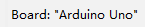
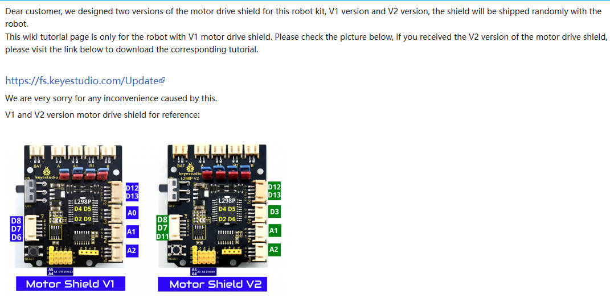
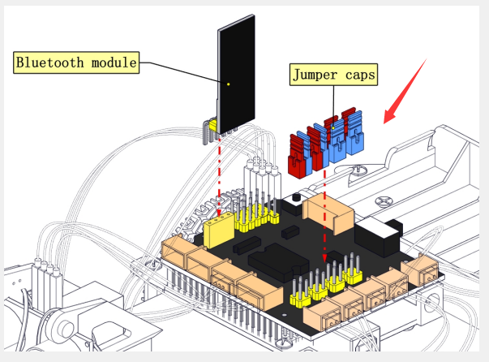
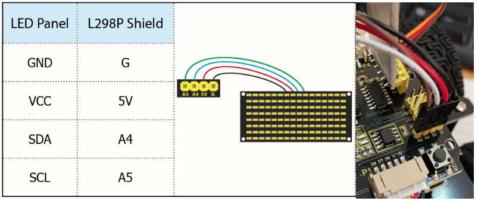

# 5. Common Troubleshooting

**1. Robot Car Unresponsive**

1.Please use battery power and check whether it is sufficient, and turn the switch of the motor driver board to ON.

2.Please check whether the wiring is correct.

Note: Before the control board leaves the factory, there is no program related to robot car. You need to upload corresponding programs to realize the function.

**2. Program Fails to Upload**

1.Unplug the Bluetooth module before uploading the program, otherwise it cannot be uploaded. Please just plug the Bluetooth in after the upload is complete;

2.Please select the correct development board and port:. You may check the port corresponding to the development board on the device manager of your computer.

**3. Servo is Hot or Shaking Violently**

Do please reset the steering gear to 90 degrees before installing, avoiding servo being blocked and burnt when the it executes the routine program. For specific operations, please refer to **Servo Installation** in the installation steps.

**4. APP Disabled or Unresponsive Connection to Bluetooth**

1.Please open your the positioning if your phone is Android system.

2.APP does not respond when controlling robot car: make sure that the functional program controlled by APP has been uploaded. Separate courses for each sensor are provided in the course. So when you find that one sensor does not respond, you may refer to the course to have a check and test. For example, when using APP to control the robot car without response, please refer to **Project 14: Bluetooth Control Robot** to test the Bluetooth module to see if the Bluetooth module receives data normally.

**5. One-side Wheel of Mini Car Is Moving After Uploading Motor Test Program**

1.Please check the model of the driver board of the motor. This will happen if you download and use a wrong file. You may upload **Lesson 5 Program** to test whether the motor is in good condition.

2.Please check whether jumper caps of the motor drive board are inserted backwards. Please correct them if so.

**6.Dot matrix Is Unable to bright**

Please check whether the wiring is correct, referring to **Project 4 Test Program**

**7.Motor does not run after uploading code containing motor control**

1.The direction pin is D4 and the speed pin is D5 for motor B, and the direction pin is D2 and the speed pin is D9 for motor A. It cannot be changed to any other pin when writing the motor code.

2.Note that the red and blue 8 jumper caps must all be installed on the expansion board.